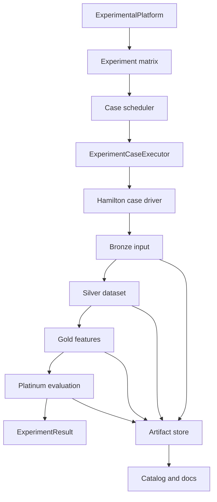

# Feature Forge: Hamilton + Medallion-Lite Implementation Specification and Handoff

**Repository:** `minghao51/feature_forge`
**Reference repository:** `minghao51/equity_lake`
**Status:** PR 0 through PR 2.5 implemented in the checkout; PR 3 is next
**Date:** 2026-07-13

> **Tracking update (2026-07-14):** Implementation is now split into phase-specific
> handoffs. Start from
> [`2026-07-14-medallion-pr-index.md`](2026-07-14-medallion-pr-index.md).
> The review introduced PR 2.5 as a required stabilization gate before PR 3.

### Implementation checkpoint

The PR 0/1 foundation and Silver-first PR 2 slice are now present in the checkout:

- characterization coverage preserves the legacy `ExperimentResult` field order;
- ADRs document the Hamilton boundary, medallion-lite semantics, artifact commit protocol, and MkDocs decision;
- versioned contracts, secret-free fingerprints, and a local atomic artifact store are implemented;
- existing `DataFrameStorage` remains compatible and accepts an optional `run_id` for run-scoped paths;
- optional Hamilton/DuckDB pipeline dependencies are pinned by the lockfile (`sf-hamilton==1.90.0`, `apache-hamilton==1.90.0`, `duckdb==1.5.4`);
- profile-aware Bronze/Silver Hamilton nodes, deterministic folds/checks, durable Bronze snapshots/references, verified Silver materialization/loading, DAG rendering, and offline pipeline CI coverage are implemented;
- the review pass hardened contract strictness, secret-safe identity, cross-platform path validation, atomic/idempotent package publication, manifest integrity, source checksums, and logical dataset fingerprints;
- PR 2.5 verification reports the full 763-test non-LLM lane passed (15 deselected), followed by the added Silver layer-reuse regression passing in the 14-test focused pipeline lane (current collection: 764), plus Ruff, strict mypy, lockfile/diff, strict MkDocs, repository/docs hygiene, and isolated default/pipeline dependency audits. The lock now resolves `setuptools==83.0.0`.
- optional dependency audit caveat: aggregate `all`/CAAFE pulls `torch==2.10.0`, for which `pip-audit` reports `PYSEC-2026-139` and `CVE-2025-3000` with no fix version in this environment. Default and pipeline environments are clean.

The next phase is the PR 3 Gold method adapter and offline replay slice. The `pipeline` extra is opt-in and the default experiment execution path remains compatible.

### PR 2 implementation checkpoint

- Added strict, versioned `DatasetRequest`, `BronzeRecord`, `BronzeMaterialization`, `SilverMaterialization`, and `SilverPackage` contracts.
- Added development, CI, production, replay, and documentation profiles with network, cache, persistence, and artifact-store policies.
- Added Hamilton driver construction via `Builder.with_modules(...).with_config(...).build()` and an explicit cache whitelist; side-effecting materialization and manifest nodes are never cache-retrieved.
- Added deterministic Bronze source checksums and dataset fingerprints, canonical features/target, stable row IDs, seeded stratified/K-fold assignments, profile output, and structured required Silver checks.
- Added atomic, idempotent Bronze and Silver packages with verified manifests and `_SUCCESS` commit markers. Snapshot mode persists raw train/test Parquet; reference mode persists source identity.
- Added offline `load_silver_package()` verification for schema version, artifact hashes, row alignment, target identity, dataset fingerprint, and required checks.
- Added `docs/silver_dataflow.md`, the generated `docs/generated/silver-dag.png`, and an optional-dependency CI lane.
- No live network or LLM provider calls are required by the new tests; documentation profile construction and rendering are side-effect-free.
**Target Python:** 3.11–3.13

---

## 1. Executive decision

Feature Forge should adopt:

1. **Apache Hamilton as the inner computation/dataflow engine for one experiment case.**
2. **A lightweight medallion model as durable experiment maturity checkpoints.**
3. **The existing `ExperimentalPlatform` and execution backends as the outer experiment control plane.**
4. **Parquet for tabular artifacts, JSON for atomic manifests, sealed `jsonl.gz` for record streams, and DuckDB for the local catalog.**
5. **The existing MkDocs Material site as the canonical documentation system initially.** Astro is deferred until an interactive experiment catalog has a demonstrated need.

This is intentionally not a traditional enterprise data lake. Feature Forge does not need Delta Lake, date-partitioned ingestion tables, merge/upsert semantics, or mandatory persistence of every intermediate value.

The goal is to make expensive feature experiments:

- reusable;
- independently verifiable;
- replayable without another LLM call;
- resumable after interruption;
- comparable under identical evaluation splits;
- traceable from source dataset to final metric.

---

## 2. Current-state findings that drive the design

### 2.1 Existing strengths to preserve

Feature Forge already has strong horizontal extension seams:

- `MethodProtocol`, `BaseMethod`, and `MethodRegistry`;
- entry points for methods, datasets, models, and metrics;
- `DatasetRegistry` for data discovery;
- `ExperimentCase` as a serializable experiment unit;
- sequential and process-pool execution adapters;
- `ExperimentCaseExecutor` for tracker lifecycle;
- `CVEvaluator`, `ModelFactory`, and `EvaluationKit`;
- sandboxed execution of LLM-generated code;
- memory/disk/hybrid artifact modes;
- structured logging and optional W&B/MLflow;
- CI coverage for linting, typing, tests, security, hygiene, and documentation.

These should be evolved rather than replaced.

### 2.2 Current limitations

The existing execution flow is roughly:

```text
ExperimentalPlatform.run()
  -> ExperimentCaseExecutor.execute()
    -> CaseComputation.compute()
      -> DatasetRegistry.load()
      -> method.fit()
      -> method.transform()
      -> CVEvaluator.evaluate_baseline()
      -> CVEvaluator.evaluate_feature()
      -> ExperimentResult
```

Important gaps:

1. **The inner computation is imperative and coarse-grained.** Dataset preparation, feature generation, verification, selection, and evaluation are not visible as a single inspectable DAG.
2. **Artifacts are not run-scoped.** `DataFrameStorage` derives filenames from descriptive keys, which can collide or be overwritten.
3. **Writes are not manifest-driven or visibly atomic.** There is no commit marker establishing when a layer is complete.
4. **`ExperimentResult` is too narrow.** It does not reference durable artifacts, stage status, fingerprints, fold-level evidence, or validation outcomes.
5. **Replay is incomplete.** Generated code can be retained, but there is no first-class offline replay contract that forbids provider calls.
6. **Resume is incomplete.** The system cannot reliably locate and reuse the last verified stage.
7. **The baseline cache is not durable or content-safe.** `CorePipeline` keys it using columns, row count, and `id(y)`. This can neither survive a process boundary nor establish dataset identity.
8. **Feature count reporting is inaccurate.** `CaseComputation` sets `num_features_generated=len(method.generated_scripts)`, which counts code blocks rather than feature columns/specifications.
9. **Evaluation evidence is aggregated too early.** Fold assignments and fold-level predictions/metrics are not durable outputs.
10. **Selection defaults to `gain > 0`.** A tiny positive CV difference is not enough evidence that a feature is useful.
11. **Nested concurrency can oversubscribe resources.** Experiment process pools, async LLM calls, sandbox workers, joblib CV, and model/BLAS threads need one coordinated resource policy.

### 2.3 Reference patterns from Equity Lake

Borrow these ideas from Equity Lake:

- explicit layer entry/exit contracts;
- required versus optional failure classification;
- idempotent, scope-aware execution;
- dry-run with no side effects;
- explicit authorization for expensive recovery;
- structured stage results;
- post-run verification and health reporting;
- code-generated dataflow documentation.

Do not copy its time-series-specific physical design or manually sequence the new Feature Forge pipeline with a growing set of `if/else` stage calls.

---

## 3. Goals, non-goals, and success measures

### 3.1 Goals

- Permit a change to model, metric, selection policy, or validation rule without repeating unaffected LLM generation.
- Give each experiment case a deterministic identity and immutable artifact namespace.
- Make a completed Gold feature package executable offline against compatible input data.
- Make every Platinum metric reconstructable from stored fold evidence.
- Detect target leakage, row misalignment, schema drift, invalid generated values, and train/inference divergence before publishing a result.
- Preserve the current public experiment facade and plugin architecture.
- Generate DAG and contract documentation from executable code.
- Allow future orchestration backends without making one a core dependency now.

### 3.2 Non-goals

- Building a general-purpose lakehouse.
- Introducing Delta Lake in the initial implementation.
- Persisting every Hamilton node result.
- Making each generated feature a Hamilton node.
- Replacing W&B or MLflow with the artifact catalog.
- Replacing method-specific MALMAS agents, memory, routing, or code generation with generic abstractions.
- Supporting distributed execution in the first release.
- Migrating the documentation site to Astro before an interactive catalog is justified.
- Solving multi-table relational feature engineering in this refactor.

### 3.3 Success measures

The refactor is successful when:

- changing only the model or metric reuses Silver and Gold without an LLM call;
- a killed process can resume at the last committed layer;
- two simultaneous runs cannot overwrite one another;
- a run can be verified without executing the experiment again;
- replay mode fails if any code path tries to initialize or call an LLM provider;
- baseline and enhanced evaluation use the exact same persisted folds;
- every result records source, code, configuration, environment, and artifact fingerprints;
- existing `ExperimentalPlatform.run()` consumers continue to work;
- CI executes a deterministic offline end-to-end case.

---

## 4. Architectural boundaries

### 4.1 Two-level execution model



**Outer control plane owns:**

- dataset × method × model × seed expansion;
- case scheduling;
- process boundaries;
- global resource budgets;
- retry and cancellation policy;
- tracker lifecycle;
- aggregate reporting.

**Hamilton case DAG owns:**

- dataset resolution and canonicalization;
- validation and profiling;
- feature specification generation;
- code generation and sandbox execution;
- candidate verification and selection;
- fold generation and evaluation;
- layer materialization;
- node lineage and timing.

### 4.2 Required public compatibility

The following should remain supported:

```python
platform = ExperimentalPlatform()
results = platform.run(
    datasets=["titanic"],
    methods=["malmas", "openfe"],
    models=["xgboost"],
    seeds=[42],
)
```

New behavior should initially be opt-in:

```python
results = platform.run(
    datasets=["titanic"],
    methods=["malmas"],
    models=["xgboost"],
    execution_profile="hamilton",
    artifact_policy="layer_boundaries",
)
```

After parity and migration criteria are met, `execution_profile="hamilton"` can become the default. Keep a temporary `legacy` profile for one deprecation cycle.

---

## 5. Medallion-lite semantic model

The layer name indicates increasing trust and reuse. A layer is committed only after all required exit checks pass.

### 5.1 Bronze: reproducible source input

**Purpose:** Record exactly what entered the experiment.

**Inputs:**

- `DatasetRequest`;
- dataset registry entry;
- local, Kaggle, or entry-point loader.

**Outputs:**

- source reference or raw snapshot;
- source checksum/fingerprint;
- target declaration;
- source metadata and license where available;
- row/column counts;
- `BronzeManifest`.

**Physical-copy rule:**

- Snapshot mutable, remote, generated, or difficult-to-retrieve inputs.
- Permit reference-plus-checksum for immutable local fixtures and stable packaged samples.
- Never claim reproducibility from a URL/slug alone.

**Required exit checks:**

- source is readable;
- target metadata exists;
- checksum is computed;
- train data exists and is non-empty;
- declared task is supported;
- no secret appears in the serialized configuration.

### 5.2 Silver: canonical experimental dataset

**Purpose:** Establish the shared trusted input for all feature methods.

**Outputs:**

- canonical `X` and `y` with stable row IDs;
- typed schema;
- persisted fold assignments;
- dataset profile;
- leakage and quality report;
- dataset fingerprint;
- `SilverManifest`.

**Required exit checks:**

- row IDs are unique and non-null;
- target is absent from `X`;
- target and task are compatible;
- fold assignments are exhaustive and non-overlapping;
- transformations did not silently add/drop rows;
- schema coercions are within policy;
- no target-derived or post-outcome field is approved as an input;
- train/validation preprocessing state is fit only on training folds.

**Conditional warnings:**

- high missingness;
- class imbalance;
- high cardinality;
- constant or near-constant columns;
- train/test drift;
- suspicious identifier-like columns.

### 5.3 Gold: candidate and accepted feature products

**Purpose:** Persist the expensive, replayable output of feature generation.

**Outputs:**

- feature specifications;
- generated Python source;
- candidate feature matrix;
- accepted feature matrix or accepted-column list;
- per-feature provenance;
- verification and selection decisions;
- generation cost/timing metadata;
- `GoldManifest`.

**Required exit checks:**

- sandbox policy passed;
- output row IDs exactly match Silver;
- feature names are unique and do not shadow base inputs;
- generated values respect NaN/Inf policy;
- transform uses no target at inference time;
- stored source/specifications replay to the same schema;
- train and inference code path is the same;
- each accepted/rejected feature has an explicit reason.

**Important:** Store candidate features, not only accepted features. This permits selection policies to change without another LLM call.

### 5.4 Platinum: evaluation evidence

**Purpose:** Produce decision-ready comparison evidence.

**Outputs:**

- baseline fold metrics;
- enhanced fold metrics;
- fold predictions and row IDs;
- aggregate metrics and gain;
- uncertainty estimates;
- feature importance when configured;
- final case summary;
- `PlatinumManifest`.

**Required exit checks:**

- baseline and enhanced paths use identical folds;
- all predictions join back to a Silver row ID;
- metric direction is known;
- configured minimum successful-fold policy is met;
- aggregate metrics reconstruct from fold metrics;
- all referenced upstream manifests verify;
- final result points to the Platinum artifact namespace.

---

## 6. Physical artifact design

### 6.1 Recommended local layout

```text
data/
├── lake/
│   ├── 01_bronze/
│   │   └── datasets/{dataset_id}/{source_version}/
│   ├── 02_silver/
│   │   └── datasets/{dataset_id}/{dataset_version}/
│   ├── 03_gold/
│   │   └── runs/{run_id}/
│   └── 04_platinum/
│       └── runs/{run_id}/
├── catalog/
│   ├── catalog.duckdb
│   └── snapshots/
└── cache/
    ├── hamilton/
    └── llm/
```

`data/cache` is disposable. `data/lake` is durable experimental evidence. Do not mix the two.

### 6.2 Gold package

```text
03_gold/runs/{run_id}/
├── manifest.json
├── _SUCCESS
├── candidate_features.parquet
├── accepted_features.parquet
├── feature_specs.jsonl.gz
├── feature_decisions.parquet
├── generated_code/
│   ├── agent_unary_round_000.py
│   └── ...
├── verification.json
├── lineage.json
└── events.jsonl.gz
```

### 6.3 Platinum package

```text
04_platinum/runs/{run_id}/
├── manifest.json
├── _SUCCESS
├── fold_assignments.parquet
├── fold_metrics.parquet
├── predictions.parquet
├── aggregate_metrics.json
├── feature_importance.parquet       # optional
├── model/                            # optional
├── report.json
└── events.jsonl.gz
```

### 6.4 Format policy

| Information | Format | Contract |
|---|---|---|
| DataFrames, features, predictions, metrics | Parquet | Typed, columnar, queryable by DuckDB/Polars/pandas |
| One manifest or report | JSON | Atomic, directly addressable, Pydantic-validated |
| Feature specifications and events | `jsonl.gz` | One schema-versioned record per line; sealed on completion |
| Generated code | `.py` | Human-diffable and directly replayable |
| Cross-run index | DuckDB | Derived and rebuildable from manifests |
| Documentation snapshots | Small JSON files | Generated from the catalog; browser-friendly |

### 6.5 JSONL compression lifecycle

- Write events to a temporary uncompressed stream during execution.
- Flush and close it before commit.
- Compress deterministically to `events.jsonl.gz`.
- Compute the checksum after compression.
- Add it to the manifest.
- Delete the temporary stream only after successful commit.
- Do not use one repository-wide append-only gzip file.

### 6.6 Atomic commit protocol

For each layer:

1. Write under `{final_path}.tmp-{uuid}`.
2. Validate every artifact.
3. Generate manifest with hashes, sizes, row counts, and schemas.
4. Write manifest last inside the temporary directory.
5. Atomically rename temporary directory to the final path where supported.
6. Write `_SUCCESS` last.
7. Treat a directory without `_SUCCESS` as incomplete and never reusable.

Failed temporary directories may be retained for diagnosis under a configurable TTL, but cannot be indexed as completed artifacts.

---

## 7. Identity, hashing, and reproducibility

### 7.1 Dataset fingerprint

Compute from canonical, secret-free values:

```text
dataset_fingerprint = sha256(
    source_checksum
    + canonicalization_config
    + schema_version
    + target_name
    + task
    + split_policy
    + split_seed
)
```

Do not hash raw secret values. Replace secret fields with `{"configured": true}` or remove them from the normalized payload.

### 7.2 Case fingerprint

```text
case_fingerprint = sha256(
    dataset_fingerprint
    + method_name
    + method_distribution_version
    + method_config
    + prompt_bundle_fingerprint
    + model_name
    + evaluation_config
    + seed
    + source_commit
    + lockfile_fingerprint
)
```

Human-facing run ID:

```text
{utc_timestamp}-{dataset}-{method}-{case_fingerprint[:12]}
```

Fingerprint and run ID are separate fields. Two intentionally repeated executions may share a case fingerprint but must have distinct run IDs.

### 7.3 Required environment capture

- Git commit SHA;
- dirty-worktree flag where locally available;
- Python version;
- operating system and architecture;
- Feature Forge version;
- plugin distribution names and versions;
- `uv.lock` fingerprint;
- model/provider identifier, excluding credentials;
- all random seeds;
- Hamilton version;
- artifact schema versions.

---

## 8. Core contracts

Place contracts in `src/feature_forge/contracts/`. Prefer frozen Pydantic models for persisted contracts and dataclasses only for internal transient values.

### 8.1 Enumerations

```python
class Layer(str, Enum):
    BRONZE = "bronze"
    SILVER = "silver"
    GOLD = "gold"
    PLATINUM = "platinum"

class RunState(str, Enum):
    PLANNED = "planned"
    RUNNING = "running"
    PARTIAL = "partial"
    SUCCEEDED = "succeeded"
    FAILED = "failed"
    CANCELLED = "cancelled"

class FailureClass(str, Enum):
    TRANSIENT = "transient"
    DETERMINISTIC = "deterministic"
    POLICY = "policy"
    RESOURCE = "resource"
    CANCELLED = "cancelled"
```

### 8.2 Artifact descriptor

```python
class ArtifactDescriptor(BaseModel):
    schema_version: str
    name: str
    layer: Layer
    media_type: str
    relative_path: str
    sha256: str
    size_bytes: int
    row_count: int | None = None
    column_count: int | None = None
    schema_fingerprint: str | None = None
    required: bool = True
```

### 8.3 Stage result

```python
class StageResult(BaseModel):
    stage: str
    state: RunState
    started_at: datetime
    finished_at: datetime | None = None
    duration_ms: float | None = None
    artifacts: list[ArtifactDescriptor] = []
    checks: list[CheckResult] = []
    failure_class: FailureClass | None = None
    error_type: str | None = None
    error_message: str | None = None
    skipped_reason: str | None = None
```

### 8.4 Run manifest

```python
class RunManifest(BaseModel):
    schema_version: str
    run_id: str
    case_fingerprint: str
    parent_run_id: str | None = None
    state: RunState
    request: RunRequest
    environment: EnvironmentSnapshot
    stages: list[StageResult]
    upstream_manifests: list[ManifestRef]
    artifacts: list[ArtifactDescriptor]
    created_at: datetime
    completed_at: datetime | None = None
```

### 8.5 Extended experiment result

Preserve existing fields and add optional fields to avoid breaking consumers:

```python
@dataclass
class ExperimentResult:
    dataset: str
    method: str
    model: str
    seed: int
    cv_score: float | None = None
    gain: float | None = None
    baseline_score: float | None = None
    num_features_generated: int | None = None
    error: str | None = None
    run_id: str | None = None
    case_fingerprint: str | None = None
    state: str | None = None
    manifest_uri: str | None = None
    uncertainty: dict[str, float] | None = None
```

`num_features_generated` must count generated feature specifications/columns, not code blocks. Add separate fields later if needed:

- `num_feature_specs`;
- `num_candidate_features`;
- `num_accepted_features`;
- `num_generated_scripts`.

### 8.6 Protocols

```python
class ArtifactStore(Protocol):
    def begin(self, namespace: ArtifactNamespace) -> StagingArea: ...
    def commit(self, staging: StagingArea) -> ManifestRef: ...
    def verify(self, ref: ManifestRef) -> VerificationReport: ...
    def resolve(self, ref: ArtifactRef) -> Path: ...

class RunRepository(Protocol):
    def create(self, request: RunRequest) -> RunManifest: ...
    def update_stage(self, run_id: str, result: StageResult) -> None: ...
    def find_reusable(self, fingerprint: str, layer: Layer) -> ManifestRef | None: ...
    def find_resumable(self, run_id: str) -> RunManifest | None: ...

class CaseScheduler(Protocol):
    def run(self, cases: Sequence[ExperimentCase]) -> list[ExperimentResult]: ...
```

---

## 9. Proposed source layout

```text
src/feature_forge/
├── api.py
├── platform.py
├── config.py
├── contracts/
│   ├── __init__.py
│   ├── artifacts.py
│   ├── datasets.py
│   ├── runs.py
│   ├── stages.py
│   └── validation.py
├── dataflows/
│   ├── __init__.py
│   ├── driver.py
│   ├── bronze/
│   │   ├── ingest.py
│   │   └── manifest.py
│   ├── silver/
│   │   ├── canonicalize.py
│   │   ├── splits.py
│   │   ├── profile.py
│   │   └── validate.py
│   ├── gold/
│   │   ├── generate.py
│   │   ├── execute.py
│   │   ├── verify.py
│   │   ├── select.py
│   │   └── provenance.py
│   └── platinum/
│       ├── evaluate.py
│       ├── uncertainty.py
│       └── report.py
├── orchestration/
│   ├── __init__.py
│   ├── scheduler.py
│   ├── resources.py
│   ├── recovery.py
│   └── backends/
│       ├── sequential.py
│       └── process_pool.py
├── storage/
│   ├── __init__.py
│   ├── artifact_store.py
│   ├── local.py
│   ├── atomic.py
│   ├── catalog.py
│   └── hashing.py
├── verification/
│   ├── __init__.py
│   ├── bronze.py
│   ├── silver.py
│   ├── gold.py
│   └── platinum.py
├── methods/
├── evaluation/
├── experiment/
└── observability/
    └── hamilton_adapter.py
```

Avoid moving method-specific MALMAS modules merely to match the new package layout. Generic dataflow nodes should call stable method interfaces; they should not absorb MALMAS internals.

---

## 10. Hamilton integration specification

### 10.1 Dependency strategy

Add Hamilton as an optional extra during the parity phase:

```toml
[project.optional-dependencies]
pipeline = [
    "sf-hamilton",  # replace with the tested compatible range in the PR
    "duckdb",       # replace with the tested compatible range in the PR
]
```

The implementing agent must select and lock exact compatible versions using the current package index and official Hamilton documentation. The unbounded entries above are illustrative and must not be copied unchanged into the final dependency file.

Once Hamilton is the default execution profile, move it to core dependencies if every standard installation requires it.

### 10.2 Driver factory

All drivers must be built in one place:

```python
def build_driver(
    *,
    profile: ExecutionProfile,
    settings: Settings,
    artifact_store: ArtifactStore,
    adapters: Sequence[LifecycleAdapter] = (),
) -> driver.Driver:
    ...
```

Profiles:

| Profile | Network/LLM | Persistence | Cache | Intended use |
|---|---:|---:|---:|---|
| `development` | allowed | optional | local | interactive work |
| `ci` | forbidden | temp | disabled/isolated | deterministic tests |
| `production` | allowed | durable | durable | full experiments |
| `replay` | forbidden | durable | read-only where possible | offline reproduction |
| `documentation` | forbidden | none | none | graph/schema generation |

### 10.3 Node granularity

Recommended logical nodes:

```text
dataset_request
raw_dataset
source_metadata
bronze_manifest
canonical_features
canonical_target
row_ids
fold_assignments
dataset_profile
silver_checks
silver_manifest
method_instance
feature_specs_by_agent_round
generated_code_by_agent_round
candidate_features
gold_checks
feature_decisions
accepted_features
gold_manifest
baseline_fold_results
enhanced_fold_results
aggregate_metrics
uncertainty_summary
platinum_checks
platinum_manifest
experiment_result
```

Do not create a node for every feature. Represent dynamic collections as typed values such as:

```python
FeatureBatch(agent: str, round_index: int, specs: tuple[FeatureSpec, ...])
```

### 10.4 Hamilton features to use

- `Builder.with_modules()` for layer and method modules;
- configuration-based module/node selection;
- tags for layer, cost, sensitivity, owner, and persistence policy;
- output checks for boundary validation;
- data loaders/savers or materializers at layer boundaries;
- `.with_cache()` only for deterministic reusable nodes;
- lifecycle adapters for timing, cache status, failures, and artifact references;
- graph visualization for generated documentation;
- dynamic parallel execution only after a bounded benchmark proves value.

### 10.5 Tagging convention

Every durable or expensive node should include equivalent metadata:

```python
@tag(
    layer="gold",
    cost="expensive",
    persistence="boundary",
    sensitivity="dataset-derived",
    owner="methods",
)
```

Allowed values should be constants/enums, not arbitrary strings scattered through modules.

### 10.6 Cache policy

Keep two caches distinct:

| Cache | Key scope | Purpose | Durable evidence? |
|---|---|---|---:|
| LLM response cache | provider, model, parameters, messages, prompt version | Avoid repeated provider calls | No |
| Hamilton node cache | code version, input versions, node policy | Avoid repeated deterministic computation | No |
| Medallion artifact | case/dataset fingerprint and committed manifest | Reuse and audit | Yes |

Never use cache presence as proof that a layer completed. Only a verified manifest and `_SUCCESS` establish completion.

### 10.7 Overrides and testing

Hamilton inputs/overrides should support unit tests that replace:

- raw dataset loading;
- LLM feature generation;
- sandbox execution;
- model evaluation;
- artifact persistence.

Each dataflow module must be testable without network access and without constructing a real provider client.

---

## 11. Feature iteration and replay behavior

### 11.1 Reuse matrix

| Requested change | Lowest reusable layer | Rerun |
|---|---|---|
| Model hyperparameters | Gold | Platinum |
| Metric | Gold | Platinum |
| Confidence/effect threshold | Gold candidates | selection + Platinum |
| Gold validation policy | Gold candidates | verification onward |
| Agent router strategy | Silver | Gold + Platinum |
| Prompt template | Silver | Gold + Platinum |
| Code generator model | Silver/specs depending on contract | code generation onward |
| Dataset cleaning | Bronze | Silver onward |
| Split seed/policy | Bronze/canonical data | Silver folds onward |
| Source version | none | full pipeline |

### 11.2 Replay mode

Replay must:

- load a verified Silver manifest;
- load stored Gold specifications and generated code;
- reconstruct candidate features in the sandbox;
- verify the resulting schema and hashes where deterministic;
- run selection/evaluation as requested;
- reject any attempt to invoke LLM generation;
- create a new run with `parent_run_id` and lineage to reused artifacts.

Replay should support:

```bash
uv run feature-forge replay --run-id <run> --from gold
uv run feature-forge replay --manifest <path> --model random_forest
```

Exact CLI naming may follow the repository's existing CLI conventions, but behavior is normative.

---

## 12. Verification policy

### 12.1 Check result contract

```python
class CheckSeverity(str, Enum):
    INFO = "info"
    WARNING = "warning"
    ERROR = "error"

class CheckResult(BaseModel):
    check_id: str
    severity: CheckSeverity
    passed: bool
    observed: Any | None = None
    expected: Any | None = None
    message: str
    affected_artifacts: list[str] = []
```

### 12.2 Required check registry

Use stable IDs, for example:

```text
BRONZE.SOURCE.READABLE
BRONZE.SOURCE.CHECKSUM
BRONZE.TARGET.DECLARED
SILVER.ROW_ID.UNIQUE
SILVER.TARGET.EXCLUDED
SILVER.SPLIT.NON_OVERLAP
SILVER.SCHEMA.VALID
SILVER.LEAKAGE.NO_TARGET_PROXY
GOLD.SANDBOX.PASSED
GOLD.ROWS.ALIGNED
GOLD.COLUMNS.UNIQUE
GOLD.VALUES.FINITE
GOLD.REPLAY.SCHEMA_MATCH
PLATINUM.FOLDS.IDENTICAL
PLATINUM.PREDICTIONS.JOINABLE
PLATINUM.METRICS.RECONSTRUCTABLE
PLATINUM.UPSTREAM.VERIFIED
```

### 12.3 Statistical selection policy

Replace hard-coded `gain > 0` with a policy object:

```python
class SelectionPolicy(BaseModel):
    minimum_mean_gain: float = 0.0
    minimum_lower_confidence_bound: float | None = None
    confidence_level: float = 0.95
    minimum_successful_folds: int | None = None
    multiple_comparison: Literal["none", "bonferroni", "fdr_bh"] = "none"
    max_selected_features: int | None = None
```

Initial compatibility mode may preserve `gain > 0`. The new recommended profile should require a configurable practical effect and report uncertainty. Do not silently change benchmark meaning in the first migration PR.

### 12.4 Verification commands

Required behavior:

```bash
uv run feature-forge verify run <run-id>
uv run feature-forge verify artifact <path-or-ref>
uv run feature-forge verify catalog
```

Verification must be read-only and return non-zero for failed required checks.

---

## 13. Evaluation refactor

### 13.1 Persist folds first

Refactor `CVEvaluator` so fold assignments are inputs rather than recreated privately for every call.

Proposed interface:

```python
def make_fold_assignments(
    y: pd.Series,
    task: TaskType,
    n_splits: int,
    seed: int,
) -> pd.DataFrame:
    """Return row_id, fold_id, and role assignments."""

def evaluate_on_folds(
    X: pd.DataFrame,
    y: pd.Series,
    folds: pd.DataFrame,
    model_name: str,
    metric_name: str,
) -> FoldEvaluation:
    ...
```

### 13.2 Evidence to retain

For each fold:

- fold ID;
- train/validation row counts;
- metric;
- predictions and optional probabilities;
- target;
- row ID;
- model parameters;
- duration;
- status/error.

### 13.3 Uncertainty

At minimum report:

- mean fold gain;
- standard deviation;
- standard error;
- configured confidence interval method;
- repeated-seed distribution when multiple seeds exist.

Bootstrap or paired fold/seed analysis can be added, but the method and assumptions must be recorded in the manifest.

---

## 14. Orchestration, failure, and resource policy

### 14.1 Run state transitions

```text
PLANNED
  -> RUNNING
    -> SUCCEEDED
    -> PARTIAL
    -> FAILED
    -> CANCELLED
```

Layer/stage transitions must be recorded individually. A process crash must not leave the run marked `RUNNING` forever; verification/recovery should detect stale runs.

### 14.2 Failure classification

| Class | Example | Automatic retry? |
|---|---|---:|
| Transient | provider timeout, temporary file lock | bounded yes |
| Deterministic | invalid generated syntax after configured repair attempts | no |
| Policy | leakage or sandbox violation | no |
| Resource | timeout/OOM | only with safer resource configuration |
| Cancelled | user/worker cancellation | no |

Do not retry an entire case when only one idempotent node failed and upstream artifacts are committed.

### 14.3 Partial success

`PARTIAL` is allowed only when:

- a configured optional artifact fails, and
- the final required result remains valid.

Examples might include optional feature importance or an external tracker failure. Missing required folds, invalid features, or absent manifests are failures, not partial success.

### 14.4 Dry run

Dry-run must perform:

- configuration validation;
- registry resolution;
- case expansion;
- DAG construction;
- artifact-path planning;
- estimated resource/call summary where possible.

Dry-run must not perform:

- network access;
- provider initialization/calls;
- sandbox code execution;
- model training/inference;
- persistent writes;
- catalog mutation.

### 14.5 Resource budget

Add configuration similar to:

```python
class ResourceConfig(BaseModel):
    experiment_workers: int = 1
    llm_concurrency: int = 3
    sandbox_workers: int = 2
    cv_workers: int = 4
    model_threads: int = 1
    memory_budget_mb: int | None = None
```

The scheduler must resolve this into a safe plan. Defaults should avoid multiplying process-pool workers by joblib workers and model threads.

Initial policy:

- only one heavy parallelism layer enabled by default;
- `OMP_NUM_THREADS`, `MKL_NUM_THREADS`, and model thread counts constrained in workers;
- process-pool failures returned as per-case failures unless `fail_fast=True`;
- results correlated to input case order or explicit case IDs.

---

## 15. Configuration additions

Suggested additions to `Settings`:

```python
class ArtifactStoreConfig(BaseModel):
    root: Path = Path("data/lake")
    policy: Literal["none", "layer_boundaries", "all_tagged"] = "layer_boundaries"
    verify_after_write: bool = True
    retain_failed_staging_hours: int = 24

class HamiltonConfig(BaseModel):
    enabled: bool = False
    cache_enabled: bool = True
    cache_dir: Path = Path("data/cache/hamilton")
    execution_profile: Literal[
        "development", "ci", "production", "replay", "documentation"
    ] = "development"

class CatalogConfig(BaseModel):
    enabled: bool = True
    path: Path = Path("data/catalog/catalog.duckdb")

class PipelineConfig(BaseModel):
    artifacts: ArtifactStoreConfig = ArtifactStoreConfig()
    hamilton: HamiltonConfig = HamiltonConfig()
    catalog: CatalogConfig = CatalogConfig()
    resources: ResourceConfig = ResourceConfig()
    selection: SelectionPolicy = SelectionPolicy()
```

All path fields must support environment overrides. Configuration fingerprints must use normalized relative/portable representations when possible.

---

## 16. Catalog and documentation

### 16.1 Catalog responsibilities

DuckDB is a derived index, not the source of truth. It should be rebuildable from manifests.

Minimum catalog tables:

```text
runs
stages
artifacts
datasets
features
feature_decisions
fold_metrics
lineage_edges
validation_checks
```

Required operations:

- index a newly committed manifest transactionally;
- rebuild from `data/lake`;
- detect missing/corrupt referenced artifacts;
- query runs by dataset, method, model, seed, metric, state, and date;
- export compact documentation snapshots.

### 16.2 MkDocs scope

Keep MkDocs Material canonical for:

- architecture;
- medallion semantics;
- pipeline contracts;
- method/plugin authoring;
- artifact schema;
- verification policy;
- recovery/replay runbook;
- generated Hamilton DAGs;
- ADRs.

Add navigation entries under `Pipeline` and `Developer` rather than replacing the existing implementation-plan documentation.

### 16.3 Generated documentation

CI should generate or verify freshness of:

- full case DAG;
- per-layer DAG;
- node/tag inventory;
- manifest JSON schemas;
- check registry;
- CLI help snippets where practical.

Generated artifacts should be deterministic. If Graphviz output contains unstable metadata, normalize it before diff checking.

### 16.4 Astro decision gate

Add Astro only if at least two of these become real requirements:

- interactive filtering across hundreds/thousands of runs;
- interactive feature lineage;
- client-side charts and comparisons;
- public experiment portal separate from developer docs;
- static deployment of catalog snapshots.

If adopted, Astro consumes generated small JSON snapshots. It must not parse every `jsonl.gz` archive in the browser.

---

## 17. Security and privacy requirements

- Secrets must never enter fingerprints, manifests, logs, generated docs, or catalog rows.
- Bronze snapshots may contain sensitive source data; support sensitivity tags and configurable retention.
- Generated code remains untrusted even if loaded from a previous successful run; replay it through the sandbox.
- Artifact paths supplied externally must be resolved beneath configured roots to prevent traversal.
- Validate compressed-file size and record limits to reduce decompression-bomb risk.
- Store code and prompts only under explicit policy when datasets may contain sensitive column values embedded in prompts.
- Record provider/model identifiers but not tokens, headers, or raw credentials.
- Catalog export for documentation should use an allowlist of fields.

---

## 18. Testing specification

### 18.1 Unit tests

Required areas:

- canonical JSON and secret redaction;
- dataset and case fingerprints;
- run ID uniqueness;
- manifest schema validation and evolution;
- artifact checksums;
- atomic staging/commit behavior;
- incomplete `_SUCCESS` handling;
- JSONL gzip sealing and reading;
- fold assignment determinism;
- row alignment checks;
- target exclusion/leakage checks;
- NaN/Inf and duplicate-column policy;
- selection policy;
- resource-budget resolution;
- failure classification;
- replay provider guard;
- catalog indexing and rebuild.

### 18.2 Contract tests

- All built-in methods satisfy `MethodProtocol`.
- Every persisted manifest round-trips through its Pydantic model.
- Every committed layer passes its verification contract.
- `ExperimentalPlatform.run()` retains existing required result keys.
- New `ExperimentResult` optional fields serialize in sequential and process modes.
- Registry-discovered methods work with the Hamilton adapter.
- Instance-local methods remain supported sequentially or produce the current explicit parallel-mode error.

### 18.3 Differential/parity tests

For fixed offline fixtures:

- legacy and Hamilton profiles use identical Silver `X`, `y`, and folds;
- deterministic method outputs match columns and values;
- baseline and enhanced metrics match within a documented tolerance;
- feature counts reflect actual candidate/accepted features;
- method-generated scripts/specifications are not duplicated unexpectedly.

LLM methods should use recorded provider fixtures or stub clients, never live calls in CI.

### 18.4 Property/metamorphic tests

- Reordering independent input columns does not corrupt row alignment.
- Re-running the same deterministic request produces the same fingerprint.
- Changing a secret does not change the fingerprint.
- Changing prompt content does change the appropriate Gold/case fingerprint.
- Changing only the model reuses Gold but changes Platinum identity.
- Duplicate row IDs always fail Silver.
- Adding the target to candidate inputs always fails the relevant leakage check.
- A killed write never yields a reusable committed layer.

### 18.5 Integration tests

Minimum offline end-to-end matrix:

| Dataset | Method | Model | Purpose |
|---|---|---|---|
| tiny classification fixture | deterministic stub method | random forest | fastest CI path |
| Titanic fixture subset | OpenFE or deterministic compatible method | XGBoost | realistic integration |
| tiny regression fixture | deterministic stub method | random forest | task coverage |
| recorded MALMAS fixture | stubbed LLM | XGBoost | generation/replay path |

Scenarios:

- full run;
- dry run;
- replay from Gold;
- resume after Silver;
- corrupt artifact detection;
- one failed process-pool case among successful cases;
- optional tracker failure producing allowed partial status;
- parallel runs with no artifact collision.

### 18.6 CI changes

Add jobs gradually:

1. contract/schema tests;
2. offline Hamilton smoke test;
3. generated documentation freshness;
4. replay test;
5. artifact/catalog verification.

Keep network and LLM markers excluded from required CI.

---

## 19. Migration and compatibility plan

### 19.1 Strangler migration

Do not rewrite `CorePipeline` and `CaseComputation` in one step.

1. Introduce contracts and storage independently.
2. Wrap current execution outputs into manifests.
3. Add a Hamilton profile alongside legacy execution.
4. Establish parity on deterministic cases.
5. Move default execution to Hamilton.
6. Deprecate legacy profile.
7. Remove legacy sequencing only after one release/deprecation window.

### 19.2 Artifact adapter

Keep `ArtifactConfig` and `DataFrameStorage` working initially. Introduce an adapter that writes into the new run namespace when a run context is present.

Do not silently reinterpret existing `.feature_forge_artifacts` directories as verified medallion artifacts. They lack manifests and should remain legacy/unverified.

### 19.3 API compatibility

- Existing required `ExperimentResult` fields remain.
- New fields are optional in the first release.
- Reporter must tolerate both old and new result dictionaries.
- Existing method plugins should not need to import Hamilton.
- Hamilton-specific interfaces live in Feature Forge adapters, not third-party methods.

### 19.4 Schema evolution

- Every persisted record has `schema_version`.
- Readers accept supported older versions through explicit migrations.
- Writers emit only the current version.
- Unknown future major versions fail clearly.
- Never mutate a historical manifest in place; derive a migrated view or write a new versioned artifact.

---

## 20. Implementation phases and PR handoff

Each PR must be independently testable and should not combine public API breakage with large dataflow changes.

### PR 0 — Characterization and ADRs

**Purpose:** Lock behavior before refactoring.

**Deliverables:**

- ADR: Hamilton inner DAG / outer scheduler boundary.
- ADR: medallion-lite semantics.
- ADR: artifact formats and commit protocol.
- ADR: MkDocs now, Astro deferred.
- golden offline experiment fixtures;
- characterization tests for current result shape and method behavior;
- baseline runtime, memory, and artifact-size notes.

**Acceptance:**

- no functional production change;
- current supported API captured by contract tests;
- open decisions listed with owners.

### PR 1 — Contracts, hashing, and atomic artifact store

**Primary files:**

- `contracts/*`;
- `storage/hashing.py`;
- `storage/atomic.py`;
- `storage/local.py`;
- tests for all new contracts.

**Tasks:**

- implement normalized secret-free serialization;
- implement artifact and manifest models;
- implement dataset/case fingerprint helpers;
- implement staging and atomic commit;
- verify hashes after write;
- make paths run-scoped;
- add `_SUCCESS` semantics;
- adapt existing artifact storage without removing it.

**Acceptance:**

- concurrent runs cannot collide;
- incomplete staging cannot be reused;
- manifest verification detects corruption;
- secrets do not affect or appear in fingerprints/manifests;
- no change to default experiment execution.

### PR 2 — Silver-first Hamilton spike

**Purpose:** Validate Hamilton boundaries with the lowest-risk reusable layer.

**Tasks:**

- add optional Hamilton dependency group;
- implement driver factory and profiles;
- implement Bronze reference/snapshot nodes;
- implement canonical `X`, `y`, row IDs, folds, profile, and Silver checks;
- materialize Silver package;
- generate a Silver DAG image;
- use stub/local datasets only in required tests.

**Acceptance:**

- Hamilton DAG constructs without side effects;
- same source/config gives the same dataset fingerprint;
- invalid dataset fails before method/LLM initialization;
- Silver replay/load is deterministic;
- dry-run performs no persistence or network call.

### PR 3 — Gold method adapter and offline replay

**Tasks:**

- create a generic adapter around `MethodProtocol`;
- expose feature specification, execution, verification, and selection batches;
- persist candidate and accepted features separately;
- persist generated code and feature specifications;
- add Gold validation checks;
- implement replay provider guard;
- fix feature counts;
- replace unsafe baseline cache assumptions where they intersect the new flow.

**Acceptance:**

- built-in deterministic methods work without Hamilton imports;
- recorded MALMAS fixture produces a committed Gold package;
- Gold replay makes zero LLM calls;
- replay reproduces feature schema and values for deterministic fixtures;
- each feature has provenance and a decision reason.

### PR 4 — Platinum fold evidence and uncertainty

**Tasks:**

- make fold assignments explicit inputs;
- refactor evaluation to return fold-level evidence;
- evaluate baseline/enhanced data on identical folds;
- persist predictions and fold metrics;
- add selection policy and compatibility mode;
- compute aggregate metrics and uncertainty;
- extend `ExperimentResult` compatibly.

**Acceptance:**

- aggregates reconstruct from stored folds;
- baseline/enhanced folds match exactly;
- result links to a verified manifest;
- current Reporter handles old/new result shapes;
- compatibility profile reproduces legacy metrics within tolerance.

### PR 5 — Scheduler, resource policy, resume, and failure isolation

**Tasks:**

- add resource configuration;
- make process-pool output per-case failure-aware;
- add `fail_fast` policy;
- implement reusable-layer lookup;
- implement resume from last committed layer;
- implement retry classification;
- add full dry-run plan output;
- constrain nested parallelism.

**Acceptance:**

- one case failure does not cancel independent cases by default;
- resume skips verified upstream layers;
- changed fingerprints invalidate only affected downstream layers;
- resource plan is logged and testable;
- process and sequential modes produce compatible results.

### PR 6 — Catalog, verification CLI, and observability

**Tasks:**

- create DuckDB catalog schema;
- index committed manifests transactionally;
- rebuild catalog from artifact roots;
- implement verification commands;
- implement Hamilton lifecycle adapter;
- connect tracker artifacts/metrics without making trackers authoritative;
- add stale-run detection.

**Acceptance:**

- catalog rebuild gives the same logical index;
- verification is read-only;
- node failures identify node, layer, case, and run;
- catalog detects missing/corrupt artifacts;
- tracker failure follows optional/required policy.

### PR 7 — Documentation and operational runbook

**Deliverables:**

- pipeline overview;
- layer contracts;
- artifact/schema reference;
- replay and recovery guide;
- verification guide;
- method authoring impact guide;
- generated DAGs and check registry;
- CI freshness check;
- migration guide.

**Acceptance:**

- docs build without network access;
- generated artifacts are reproducible;
- all CLI examples are current;
- MkDocs navigation includes the new material.

### PR 8 — Optional Astro catalog

Proceed only after the decision gate in Section 16.4 is met.

**Tasks if approved:**

- generate allowlisted JSON snapshots from DuckDB;
- build dataset/run/feature comparison views;
- keep raw artifacts out of the browser bundle;
- document snapshot schema and static deployment.

---

## 21. Definition of done for every PR

- Scope matches one PR phase.
- Public behavior changes are documented.
- Unit and contract tests cover new contracts.
- No live LLM/network dependency in required CI.
- Ruff and strict mypy pass for changed source.
- New persisted schema has a version.
- New errors include case/run/stage context without secrets.
- Documentation is updated in the same PR where behavior changes.
- Migration/rollback path is stated.
- No unrelated formatting or refactor churn.
- Performance-sensitive changes include before/after measurements.

---

## 22. Risk register and mitigation

| Risk | Likelihood | Impact | Mitigation / decision |
|---|---:|---:|---|
| Hamilton wraps only `method.fit()` and yields little lineage | Medium | High | Split generic generation/execution/verification/selection batches into nodes |
| One node per feature creates huge unstable DAGs | High | High | Batch by agent/round/method; features remain records |
| Cache and medallion semantics are confused | Medium | High | Cache is disposable; only committed manifests are evidence |
| Hamilton and LLM cache duplicate large objects | Medium | Medium | Cache policy by node tag; benchmark size and hit rate |
| Existing plugin methods cannot expose internal stages | High | Medium | Support coarse adapter first; richer optional protocol later |
| Generated code cannot replay deterministically | Medium | High | Persist exact code/specs/environment and verify schema/value tolerance |
| Selection produces false positives | High | High | Effect threshold, uncertainty, repeated seeds, optional correction |
| Nested parallelism causes OOM/rate limits | High | High | Central resource budget and single heavy parallel layer by default |
| Artifact volume grows rapidly | Medium | Medium | Retention policy, optional candidate materialization, Parquet compression |
| Source snapshot duplicates large data | Medium | Medium | Allow stable reference + checksum; copy only under policy |
| New path breaks existing consumers | Medium | High | Strangler migration and optional Hamilton profile |
| Tracker and artifact records diverge | Medium | Medium | Artifact manifest authoritative; tracker stores references |
| Catalog becomes unrebuildable state | Low | High | Catalog derived from immutable manifests; test rebuild equivalence |
| Sensitive content leaks into prompts/manifests/docs | Medium | High | Redaction, allowlists, sensitivity tags, export policy |
| Astro creates a second documentation burden | Medium | Medium | Defer until explicit interaction/scale gate is met |

---

## 23. Open decisions requiring owner confirmation

These do not block PR 0–1 but should be resolved before the indicated phase.

| Decision | Recommended default | Needed by |
|---|---|---|
| Physical Bronze snapshots | Reference+checksum for stable local data; snapshot remote/mutable data | PR 2 |
| Validation library | Hamilton checks plus small internal checks; add Pandera only if schemas become complex | PR 2 |
| Candidate feature persistence | Persist by default for expensive/LLM methods; configurable for cheap methods | PR 3 |
| Selection threshold | Compatibility `gain > 0`; recommended profile adds practical threshold/CI | PR 4 |
| Confidence interval method | Paired fold/seed summary first; bootstrap after sufficient repeats | PR 4 |
| Default outer workers | 1 | PR 5 |
| External orchestrator | None initially; keep protocol | After PR 6 |
| Hamilton UI | Optional local tool, not operational dependency | After PR 6 |
| Astro | Deferred | After PR 7 |
| Retention | Keep manifests/metrics/code; configurable TTL for large candidate matrices | PR 6 |

---

## 24. Implementation-agent handoff instructions

### 24.1 Before coding

1. Read this specification fully.
2. Inspect current `platform.py`, `case_executor.py`, `execution.py`, `methods/base.py`, MALMAS pipeline, artifact storage, evaluation code, configuration, tests, and MkDocs plan pages.
3. Check repository instructions such as `AGENTS.md` and local skills.
4. Confirm the current default branch and working tree state.
5. Run the existing non-LLM test suite and record the baseline.
6. Work only on the assigned PR phase.
7. Do not add live-provider tests.

### 24.2 Design constraints for agents

- Preserve current user-facing APIs unless the assigned PR explicitly changes them.
- Prefer composition and protocols over a deep inheritance hierarchy.
- Do not make third-party methods depend on Hamilton.
- Do not persist secrets or raw provider authentication configuration.
- Do not treat a cache hit as a committed artifact.
- Do not materialize every Hamilton node by default.
- Do not implement Delta Lake or Astro during core phases.
- Do not silently accept row/index changes.
- Do not regenerate expensive upstream artifacts when a valid fingerprinted artifact exists.
- Do not broaden a failed stage's recovery scope without explicit configuration.

### 24.3 Required handoff at the end of each PR

The implementing agent must report:

- files added/changed;
- contracts introduced or changed;
- migration/compatibility behavior;
- tests run and results;
- generated artifacts/docs changed;
- performance observations;
- risks or open questions discovered;
- exact next PR prerequisites;
- any divergence from this specification with rationale.

### 24.4 Suggested PR description template

```markdown
## Objective

Implements Phase/PR N of the Hamilton + medallion-lite refactor.

## Scope

- ...

## Explicitly out of scope

- ...

## Contracts and compatibility

- ...

## Verification

- `uv run ruff check ...`
- `uv run mypy ...`
- `uv run pytest ...`

## Migration / rollback

- ...

## Risks and follow-ups

- ...
```

---

## 25. Recommended immediate next action

Start with **PR 0 followed by PR 1**, not with the MALMAS Hamilton conversion.

The first implementation milestone should prove:

1. current behavior is characterized;
2. run and dataset identity are deterministic and secret-free;
3. artifacts are run-scoped and atomic;
4. manifests can verify corruption and incomplete writes;
5. existing execution remains unchanged.

Then use **Silver-first PR 2** as the Hamilton proof. Silver has clear deterministic inputs/outputs and creates immediate reuse across every feature method. Only after that boundary is stable should the implementation move expensive and dynamic MALMAS generation into Gold.

---

## 26. Source references

- Feature Forge repository: <https://github.com/minghao51/feature_forge>
- Current experimental platform: <https://github.com/minghao51/feature_forge/blob/main/src/feature_forge/platform.py>
- Current case executor: <https://github.com/minghao51/feature_forge/blob/main/src/feature_forge/experiment/case_executor.py>
- Current execution backends/results: <https://github.com/minghao51/feature_forge/blob/main/src/feature_forge/experiment/execution.py>
- Current method abstraction: <https://github.com/minghao51/feature_forge/blob/main/src/feature_forge/methods/base.py>
- Current artifact storage: <https://github.com/minghao51/feature_forge/blob/main/src/feature_forge/artifacts/storage.py>
- Current MALMAS core pipeline: <https://github.com/minghao51/feature_forge/blob/main/src/feature_forge/methods/malmas/pipeline/core.py>
- Current evaluation: <https://github.com/minghao51/feature_forge/blob/main/src/feature_forge/evaluation/cv.py>
- Current configuration: <https://github.com/minghao51/feature_forge/blob/main/src/feature_forge/config.py>
- Current documentation configuration: <https://github.com/minghao51/feature_forge/blob/main/mkdocs.yml>
- Equity Lake architecture reference: <https://github.com/minghao51/equity_lake/blob/main/docs/developer/architecture/ARCHITECTURE.md>
- Equity Lake pipeline contracts reference: <https://github.com/minghao51/equity_lake/blob/main/docs/developer/architecture/pipeline-contracts.md>
- Apache Hamilton concepts: <https://hamilton.apache.org/concepts/>
- Apache Hamilton materialization: <https://hamilton.apache.org/concepts/materialization/>
- Apache Hamilton caching: <https://hamilton.apache.org/concepts/caching/>
- Apache Hamilton visualization: <https://hamilton.apache.org/concepts/visualization/>
