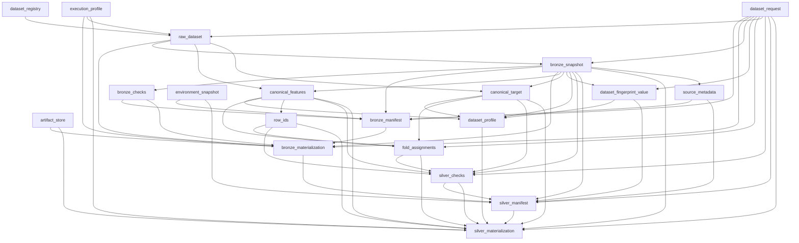
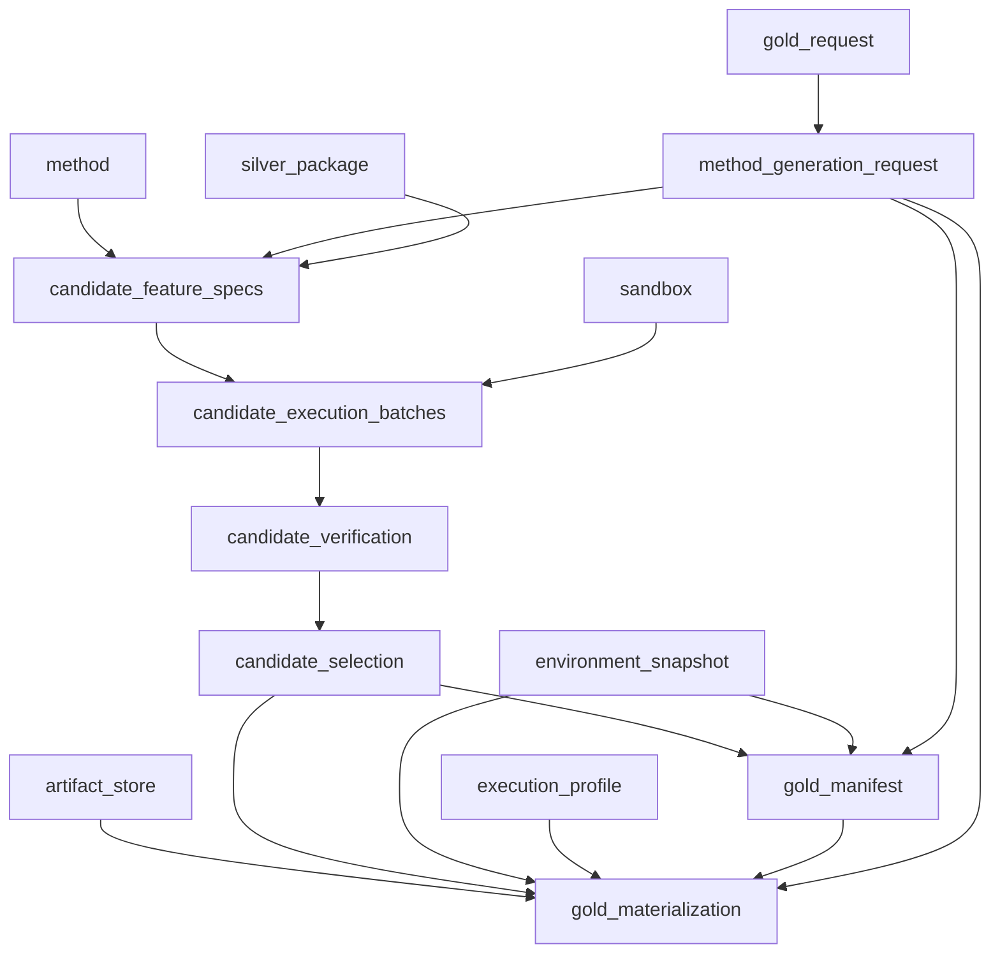
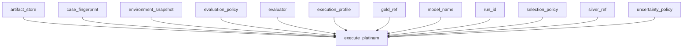

# Canonical pipeline DAGs

These portable Mermaid diagrams are generated from the normalized topology JSON.
The JSON and this page are freshness-checked on every docs build.

## Silver DAG

[Normalized topology JSON](graphs/silver.json)

## Gold DAG

[Normalized topology JSON](graphs/gold.json)

## Platinum DAG

[Normalized topology JSON](graphs/platinum.json)

## Case DAG

```mermaid
graph TD
    n0["artifact_store"]
    n1["bronze_checks"]
    n2["bronze_manifest"]
    n3["bronze_materialization"]
    n4["bronze_snapshot"]
    n5["candidate_execution_batches"]
    n6["candidate_feature_specs"]
    n7["candidate_selection"]
    n8["candidate_verification"]
    n9["canonical_features"]
    n10["canonical_target"]
    n11["case_fingerprint"]
    n12["dataset_fingerprint_value"]
    n13["dataset_profile"]
    n14["dataset_registry"]
    n15["dataset_request"]
    n16["environment_snapshot"]
    n17["evaluation_policy"]
    n18["evaluator"]
    n19["execute_platinum"]
    n20["execution_profile"]
    n21["fold_assignments"]
    n22["gold_manifest"]
    n23["gold_materialization"]
    n24["gold_ref"]
    n25["gold_request"]
    n26["method"]
    n27["method_generation_request"]
    n28["model_name"]
    n29["raw_dataset"]
    n30["row_ids"]
    n31["run_id"]
    n32["sandbox"]
    n33["selection_policy"]
    n34["silver_checks"]
    n35["silver_manifest"]
    n36["silver_materialization"]
    n37["silver_package"]
    n38["silver_ref"]
    n39["source_metadata"]
    n40["uncertainty_policy"]
    n4 --> n1
    n1 --> n2
    n4 --> n2
    n15 --> n2
    n16 --> n2
    n39 --> n2
    n0 --> n3
    n1 --> n3
    n2 --> n3
    n4 --> n3
    n15 --> n3
    n20 --> n3
    n29 --> n3
    n15 --> n4
    n29 --> n4
    n6 --> n5
    n32 --> n5
    n26 --> n6
    n27 --> n6
    n37 --> n6
    n8 --> n7
    n5 --> n8
    n4 --> n9
    n29 --> n9
    n4 --> n10
    n29 --> n10
    n4 --> n12
    n15 --> n12
    n4 --> n13
    n9 --> n13
    n10 --> n13
    n12 --> n13
    n0 --> n19
    n11 --> n19
    n16 --> n19
    n17 --> n19
    n18 --> n19
    n20 --> n19
    n24 --> n19
    n28 --> n19
    n31 --> n19
    n33 --> n19
    n38 --> n19
    n40 --> n19
    n9 --> n21
    n10 --> n21
    n15 --> n21
    n30 --> n21
    n7 --> n22
    n16 --> n22
    n27 --> n22
    n0 --> n23
    n7 --> n23
    n16 --> n23
    n20 --> n23
    n22 --> n23
    n27 --> n23
    n25 --> n27
    n14 --> n29
    n15 --> n29
    n20 --> n29
    n9 --> n30
    n4 --> n34
    n9 --> n34
    n10 --> n34
    n15 --> n34
    n21 --> n34
    n30 --> n34
    n3 --> n35
    n4 --> n35
    n12 --> n35
    n15 --> n35
    n16 --> n35
    n34 --> n35
    n39 --> n35
    n0 --> n36
    n4 --> n36
    n9 --> n36
    n10 --> n36
    n13 --> n36
    n15 --> n36
    n20 --> n36
    n21 --> n36
    n30 --> n36
    n34 --> n36
    n35 --> n36
    n4 --> n39
```

[Normalized topology JSON](graphs/case.json)
