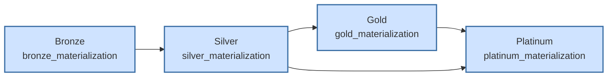
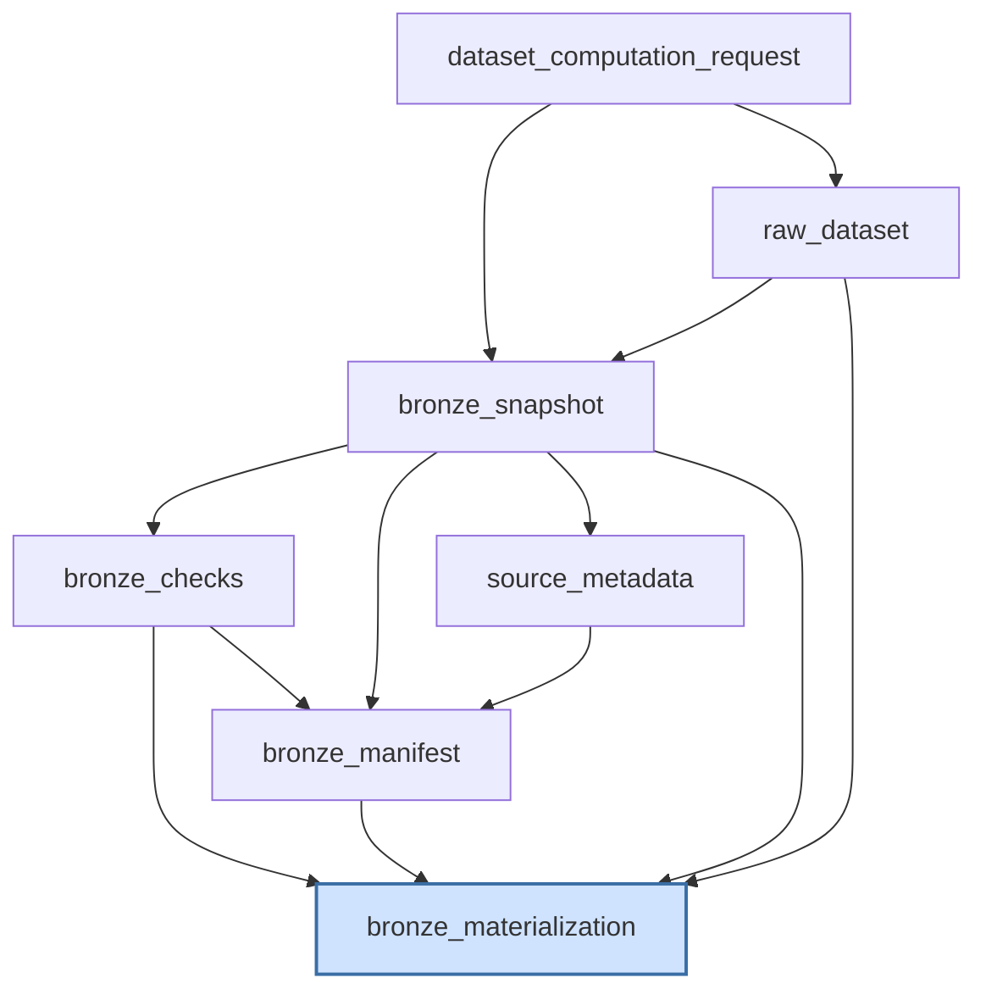
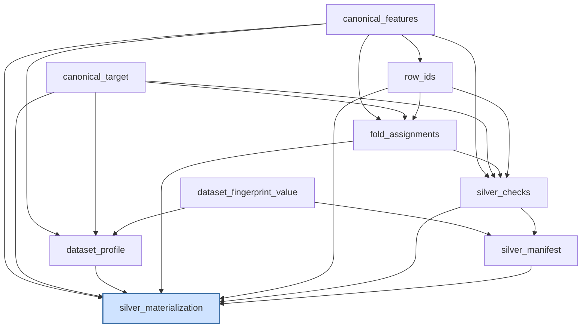
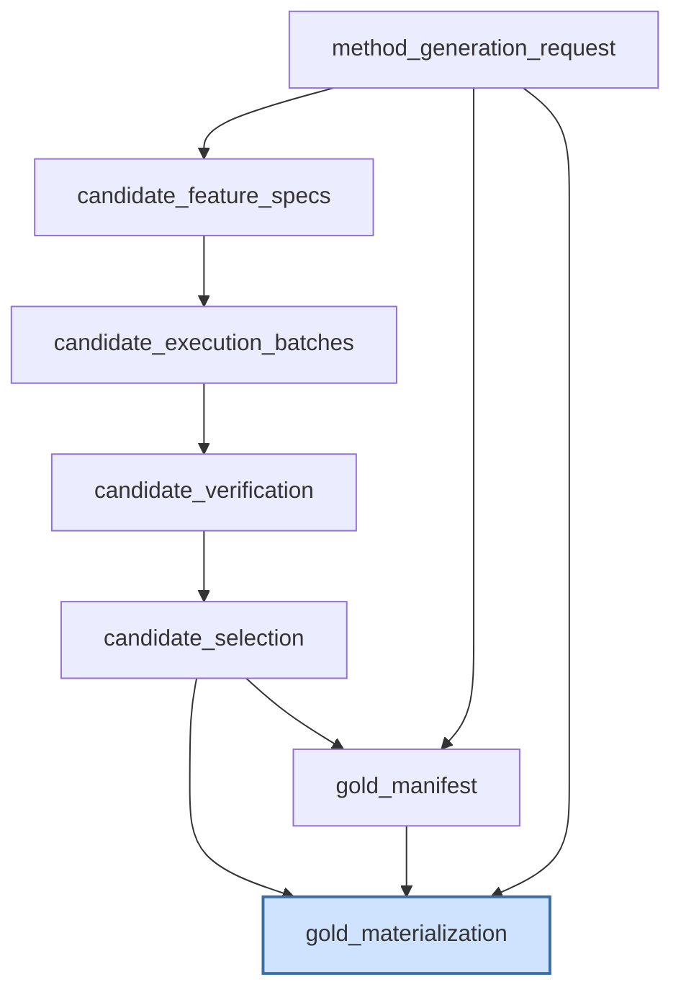
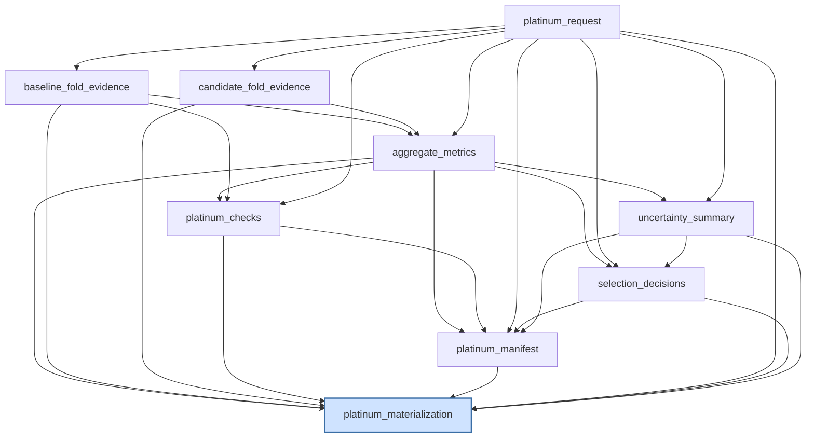

# Medallion Stage DAGs

> Auto-generated by `scripts/generate_stage_dag_docs.py`. Do not edit by hand — regenerate with `uv run python scripts/generate_stage_dag_docs.py` and commit the output. The document is deterministic (no timestamps), so it can be byte-compared against a fresh render via `--check`.

The platform decomposes each experiment case into four durable Hamilton stages — **Bronze**, **Silver**, **Gold**, and **Platinum** — spanning 32 tagged nodes across 4 modules (`feature_forge.dataflows.{bronze,silver,gold,platinum}`).

## Durable-boundary architecture

Each stage persists a verified package through its `*_materialization` boundary node. Downstream stages consume the upstream durable packages as external inputs and never recompute them; cross-stage edges below are derived from the package-typed inputs each stage declares.

## Bronze stage

Module `feature_forge.dataflows.bronze` — 7 nodes. Intra-stage edges are derived from node function signatures.

### DAG

### Node metadata

| Node | Layer | Cost | Persistence | Sensitivity | Owner | Returns | Upstream deps |
| --- | --- | --- | --- | --- | --- | --- | --- |
| `bronze_checks` | bronze | cheap | none | metadata | verification | `list[CheckResult]` | 1 (bronze_snapshot) |
| `bronze_manifest` | bronze | cheap | none | metadata | verification | `RunManifest` | 3 (bronze_checks, bronze_snapshot, source_metadata) |
| `bronze_materialization` | bronze | io | boundary | dataset-derived | storage | `BronzeMaterialization` | 4 (bronze_checks, bronze_manifest, bronze_snapshot, raw_dataset) |
| `bronze_snapshot` | bronze | cheap | boundary | dataset-derived | data | `BronzeRecord` | 2 (dataset_computation_request, raw_dataset) |
| `dataset_computation_request` | bronze | cheap | none | metadata | data | `DatasetComputationRequest` | 0 (—) |
| `raw_dataset` | bronze | io | boundary | dataset-derived | data | `dict[str, Any]` | 1 (dataset_computation_request) |
| `source_metadata` | bronze | cheap | none | metadata | data | `dict[str, Any]` | 1 (bronze_snapshot) |

## Silver stage

Module `feature_forge.dataflows.silver` — 9 nodes. Intra-stage edges are derived from node function signatures.

### DAG

### Node metadata

| Node | Layer | Cost | Persistence | Sensitivity | Owner | Returns | Upstream deps |
| --- | --- | --- | --- | --- | --- | --- | --- |
| `canonical_features` | silver | cheap | boundary | dataset-derived | data | `pd.DataFrame` | 0 (—) |
| `canonical_target` | silver | cheap | boundary | target | data | `pd.Series` | 0 (—) |
| `dataset_fingerprint_value` | silver | cheap | none | metadata | data | `str` | 0 (—) |
| `dataset_profile` | silver | cheap | boundary | dataset-derived | data | `dict[str, Any]` | 3 (canonical_features, canonical_target, dataset_fingerprint_value) |
| `fold_assignments` | silver | cheap | boundary | dataset-derived | data | `pd.DataFrame` | 3 (canonical_features, canonical_target, row_ids) |
| `row_ids` | silver | cheap | boundary | dataset-derived | data | `list[str]` | 1 (canonical_features) |
| `silver_checks` | silver | cheap | none | dataset-derived | verification | `list[CheckResult]` | 4 (canonical_features, canonical_target, fold_assignments, row_ids) |
| `silver_manifest` | silver | cheap | none | metadata | verification | `RunManifest` | 2 (dataset_fingerprint_value, silver_checks) |
| `silver_materialization` | silver | io | boundary | dataset-derived | storage | `SilverMaterialization` | 7 (canonical_features, canonical_target, dataset_profile, fold_assignments, row_ids, silver_checks, silver_manifest) |

## Gold stage

Module `feature_forge.dataflows.gold` — 7 nodes. Intra-stage edges are derived from node function signatures.

### DAG

### Node metadata

| Node | Layer | Cost | Persistence | Sensitivity | Owner | Returns | Upstream deps |
| --- | --- | --- | --- | --- | --- | --- | --- |
| `candidate_execution_batches` | gold | expensive | recompute | dataset-derived | sandbox | `dict[str, Any]` | 1 (candidate_feature_specs) |
| `candidate_feature_specs` | gold | expensive | recompute | dataset-derived | methods | `dict[str, Any]` | 1 (method_generation_request) |
| `candidate_selection` | gold | cheap | none | metadata | methods | `dict[str, Any]` | 1 (candidate_verification) |
| `candidate_verification` | gold | cheap | none | metadata | verification | `dict[str, Any]` | 1 (candidate_execution_batches) |
| `gold_manifest` | gold | cheap | recompute | metadata | verification | `RunManifest` | 2 (candidate_selection, method_generation_request) |
| `gold_materialization` | gold | io | boundary | dataset-derived | storage | `GoldMaterialization` | 3 (candidate_selection, gold_manifest, method_generation_request) |
| `method_generation_request` | gold | cheap | none | dataset-derived | methods | `GoldRequest` | 0 (—) |

## Platinum stage

Module `feature_forge.dataflows.platinum` — 9 nodes. Intra-stage edges are derived from node function signatures.

### DAG

### Node metadata

| Node | Layer | Cost | Persistence | Sensitivity | Owner | Returns | Upstream deps |
| --- | --- | --- | --- | --- | --- | --- | --- |
| `aggregate_metrics` | platinum | cheap | none | — | evaluation | `dict[str, Any]` | 3 (baseline_fold_evidence, candidate_fold_evidence, platinum_request) |
| `baseline_fold_evidence` | platinum | expensive | recompute | — | evaluation | `dict[str, Any]` | 1 (platinum_request) |
| `candidate_fold_evidence` | platinum | expensive | recompute | — | evaluation | `CandidateFoldEvidence` | 1 (platinum_request) |
| `platinum_checks` | platinum | cheap | none | — | verification | `list[CheckResult]` | 3 (aggregate_metrics, baseline_fold_evidence, platinum_request) |
| `platinum_manifest` | platinum | cheap | recompute | — | verification | `RunManifest` | 5 (aggregate_metrics, platinum_checks, platinum_request, selection_decisions, uncertainty_summary) |
| `platinum_materialization` | platinum | io | boundary | — | storage | `PlatinumMaterialization` | 8 (aggregate_metrics, baseline_fold_evidence, candidate_fold_evidence, platinum_checks, platinum_manifest, platinum_request, selection_decisions, uncertainty_summary) |
| `platinum_request` | platinum | cheap | none | — | evaluation | `PlatinumRequest` | 0 (—) |
| `selection_decisions` | platinum | cheap | none | — | evaluation | `list[PlatinumSelectionDecision]` | 3 (aggregate_metrics, platinum_request, uncertainty_summary) |
| `uncertainty_summary` | platinum | cheap | none | — | evaluation | `UncertaintySummary` | 2 (aggregate_metrics, platinum_request) |
