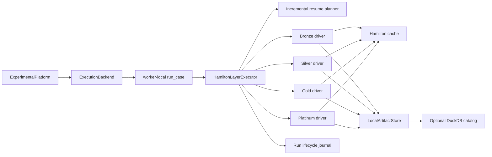
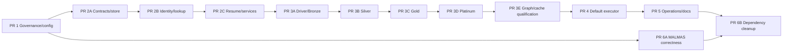

# Hamilton-Default Execution Handoff

**Date:** 2026-09-09  
**Status:** Implemented — PR 1 through PR 6 and all six legacy-removal gates are complete; ADR 0016 authorizes a separate removal change  
**Decision owner:** Maintainer  
**Source implementation:** `origin/feat/medallion-refactor` at `690a764`  
**Implementation base:** current default branch after each prerequisite PR merges  
**Related:** ADR 0001, ADR 0006, ADR 0016,
`20_long_term_roadmap.md`, `22_fail_fast_cancellation_contract.md`, `REPORT_LOG.md`

## 0. Continuation checkpoint — 2026-09-14

This checkpoint records the current working-tree state for the next agent. The
checkout contains substantial pre-existing uncommitted work; preserve it and
do not reset, clean, or overwrite unrelated files.

### Completed in the current thread

- PR 1 foundation: ADRs 0012–0015, typed `ExecutionEngine`, `DataflowConfig`,
  `HamiltonCacheConfig`, default-on Hamilton cache policy, and core
  `apache-hamilton>=1.90,<2` dependency. PR 4 has now completed the atomic
  default switch to `hamilton`.
- PR 2A/2B foundations: strict contracts, SHA-256 hashing, atomic local
  artifact publication, verification, layer fingerprints, nullable manifest
  `reuse_fingerprint`, and typed `MethodIdentity`.
- PR 2C foundation: lifecycle/resource/resume contracts, contiguous-prefix
  resume planning, verified suffix execution, and partial failure reporting.
- PR 3A–3E: stage-specific Bronze/Silver, Gold, and Platinum dataflows;
  strict layer contracts; provider-free Gold replay; verified Platinum loading;
  exact node inventories; explicit recompute boundaries; and direct cache smoke
  coverage.
- PR 4: worker-local `HamiltonLayerExecutor`, incremental verified reuse,
  lifecycle journal, public Hamilton default, explicit legacy fallback,
  sequential/process parity, and side-effect-free JSON planning CLI.
- PR 5: bounded redacted node/cache telemetry; concurrent atomic cache stores;
  cache inspection/retention and artifact verification CLI; generated DAGs;
  cache qualification; strict documentation build; and recovery guidance.
- PR 6: canonical MALMAS baseline identity; successful unique-code replay and
  schema failure evidence; direction-aware selection; fail-closed modes/agents;
  explicit warm start; random-forest core default; and heavyweight extras.
- Legacy-removal technical gates 1–5: three-version full suites, process parity,
  metric parity, recovery/replay drills, real matrix evidence, and representative
  cache timing. ADR 0016 records the gate 6 maintainer decision to remove legacy.

### Current validation

- Required `uv sync --all-groups --extra intel` completed. The full suite passed
  on Python 3.11, 3.12, and 3.13 with 954 tests and 9 expected optional-XGBoost
  skips per interpreter under explicit BLAS/OpenMP single-thread limits.
- A clean standard wheel excludes heavyweight optional packages and fits the
  random-forest default. The package-contract lane verifies named extras and
  precise installation errors.
- Ruff, formatting, strict source/test mypy, repository hygiene, documentation references,
  lock freshness, generated-doc freshness, and strict MkDocs pass.
- Provider-free Bronze/Silver qualification measured 10/10 eligible warm cache
  hits; concurrent cache publication passed five repeated spawned-worker runs.
  A 100,000-row follow-up measured 1,400.1 ms cold versus 327.0 ms warm with
  10/10 hits; evidence is under `experiments/legacy_removal/2026-09-14/`.
- End-to-end default/spawn process parity, Hamilton/legacy metric parity,
  cache deletion/corruption, package corruption recovery, provider-free replay,
  and a two-seed bundled breast-cancer matrix now pass.

### Known incomplete or intentionally transitional pieces

- All six removal gates are satisfied, but `legacy` remains in the current code
  until the dedicated ADR 0016 implementation change lands. Do not combine that
  removal with fail-fast scheduler changes.
- Hamilton cache paths supplied by CI tests must be fresh temporary paths;
  avoid reusing the repository-local cache from tests.
- `contracts/__init__.py` and `verification/__init__.py` intentionally expose
  only modules that exist in this incremental checkout. Extend exports when
  later catalog/dataflow modules land.

### Exact next assignment

Implement ADR 0016 as a dedicated legacy-removal change, including actionable
stale-configuration migration errors and documentation updates. After that
change validates independently, implement
`docs/plan/22_fail_fast_cancellation_contract.md`, beginning with ADR 0017.
Do not combine the removal and scheduler changes.

## 1. Purpose

This document is the implementation handoff for making Hamilton the default
execution engine for Feature Forge. It divides the work into reviewable PRs so
separate agents can implement each part without merging the large feature branch
wholesale.

The feature branch is reference material. Its contracts, artifact store,
verification, resume logic, tests, and dataflow nodes should be ported
surgically. Its public integration, cache policy, DAG shape, documentation, and
identity model require the changes specified here.

This plan is subordinate to the package contract in `README.md`, the active plan
index in `docs/plan/00_index.md`, and accepted ADRs in `docs/decisions/`.

It supersedes the implementation direction in the feature branch's
`.claude/handoffs/2026-07-13-medallion-refactor.md` and
`.claude/handoffs/2026-07-14-medallion-pr-index.md`. Those records retain
historical value but specify optional Hamilton, application-owned execution,
and profile-specific cache disabling that conflict with the decisions below.

Before PR 1 starts, preserve the current uncommitted work through a
maintainer-approved integration ref, record its exact SHA, and create an
isolated worktree. Every later agent assignment names the latest merged
prerequisite SHA. Implementation agents never edit the shared dirty checkout.

## 2. Maintainer decisions

The following choices are settled for this implementation:

1. `HamiltonLayerExecutor` coordinates stage-specific Hamilton DAGs.
2. Hamilton is the default execution engine for `ExperimentalPlatform`.
3. Hamilton caching is enabled by default in every execution profile.
4. The imperative engine remains available through an explicit `legacy`
   compatibility setting until parity and rollback gates pass.
5. Hamilton cache entries are disposable acceleration. Verified medallion
   packages remain the authoritative experiment evidence.
6. `LLMClient` DiskCache remains mandatory and independent of Hamilton caching.

## 3. Baseline and known gaps

The default branch currently executes cases imperatively:

```text
ExperimentalPlatform
  -> ExperimentCaseExecutor
  -> BaseMethod
  -> CVEvaluator / SandboxedExecutor
```

The feature branch adds Bronze, Silver, Gold, and Platinum contracts and
Hamilton nodes, but it is not ready to merge as one unit:

- `ExperimentalPlatform.run()` requires application-supplied layer
  fingerprints and a `LayerExecutor` callback.
- No production callback constructs or executes the Hamilton driver.
- The rendered case graph combines disconnected stage graphs.
- Platinum is represented by one large `execute_platinum` node.
- Public helper functions are unintentionally discovered as Hamilton nodes.
- The cache opts into ten Silver nodes while disabling their source dependency.
  An identical second Silver execution measured four hits, six misses, and a
  second dataset-registry load.
- Run IDs omit material experiment configuration and can collide with previous
  write-once evidence.
- Branch ADR numbering conflicts with the authoritative ADR directory.
- Branch documentation still publishes removed `ExperimentMatrix` and
  `ExperimentRunner` APIs.

### 3.1 Recorded validation baseline

Use this baseline to distinguish inherited defects from regressions introduced
by the sliced PRs:

- On `origin/feat/medallion-refactor` at `690a764`, the focused Hamilton suite
  completed with 146 passed, one skipped, and one failed test.
- The failure was the machine-readable CLI test: log output was written to
  stdout before the JSON document. PR 4 owns that integration fix.
- Ruff and mypy passed on the feature branch.
- In the current checkout, Ruff, mypy, repository hygiene, and documentation
  reference checks passed. The full pytest run reached a sandbox timeout in
  `TestCorePipeline.test_run_with_fake_agent` and then hung; treat that as an
  inherited baseline issue until a focused reproduction proves otherwise.
- The feature branch CI exercised Silver caching only. It did not prove
  Bronze, Gold, Platinum, executor, process-worker, or default-platform parity.

## 4. Architectural invariants

Every implementing PR must preserve these rules:

- `ExperimentalPlatform` owns case-matrix expansion, scheduling, process
  boundaries, tracking, cancellation, and top-level failure handling.
- `HamiltonLayerExecutor` owns dependency ordering and durable stage execution
  inside one case.
- `MethodRegistry` / `BaseMethod` remains the only extension point for methods.
- Methods do not construct Hamilton drivers and do not write medallion packages.
- Every LLM request goes through `LLMClient` and its enforced DiskCache.
- Generated feature code executes only through AST validation and process
  isolation in `SandboxedExecutor`.
- Pydantic contracts form every process, artifact, and stage boundary.
- A cache hit can accelerate computation but cannot establish successful stage
  completion.
- A layer is reusable only when its manifest, completion marker, artifact
  hashes, schema version, semantic checks, fingerprint, and upstream lineage
  verify.
- Source data under `data/` is immutable from Feature Forge's perspective.
- Runtime artifacts and traces remain under `experiments/`; custom artifact and
  cache roots must be explicit configuration overrides.

## 5. Target architecture



The stage DAGs are intentionally separate. Manifest references form the durable
edges between them. `HamiltonLayerExecutor` verifies each edge before passing it
to the next driver.

## 6. Public configuration contract

### 6.1 New configuration

Add typed configuration similar to the following. This snippet describes the
final state after PR 4; PR 1 introduces the type with a transitional `legacy`
default so every intermediate merge remains executable. Names may change during
the ADR PR, but there must be one canonical setting for the engine and one for
the Hamilton cache.

```python
from enum import StrEnum
from pathlib import Path

from pydantic import BaseModel, Field


class ExecutionEngine(StrEnum):
    HAMILTON = "hamilton"
    LEGACY = "legacy"


class HamiltonCacheConfig(BaseModel):
    enabled: bool = True
    path: Path | None = None
    log_to_file: bool = False


class DataflowConfig(BaseModel):
    engine: ExecutionEngine = ExecutionEngine.HAMILTON
    artifact_root: Path = Path("experiments/artifacts")
    cache: HamiltonCacheConfig = Field(default_factory=HamiltonCacheConfig)
```

Add `dataflow: DataflowConfig` to `Settings`. Environment overrides follow the
existing nested convention, for example:

```text
FF_DATAFLOW__ENGINE=legacy
FF_DATAFLOW__CACHE__ENABLED=false
FF_DATAFLOW__CACHE__PATH=/scratch/feature-forge-cache
```

Cache-path precedence is run override, then environment/YAML, then
`<resolved artifact_root>/control/cache/hamilton`. Never partition a persistent
cache by attempt ID because that prevents warm reuse. PR 5 introduces retention
and size-limit configuration together with the code that enforces it.

### 6.2 Simplify the platform API

`engine` is the public choice. Derive the artifact policy internally:

| Engine | Internal artifact policy | Executor |
|---|---|---|
| `hamilton` | `layer_boundaries` | `HamiltonLayerExecutor` |
| `legacy` | `legacy` | existing `ExperimentCaseExecutor` path |

Remove `layer_fingerprints` and `layer_executor` from the ordinary public call.
Dependency injection may remain on an expert/internal constructor for tests.
Reject contradictory engine/policy combinations rather than silently changing
them.

### 6.3 Dependency packaging

- Move base `sf-hamilton` from the optional `pipeline` extra into core
  dependencies. Keep graph-rendering packages and Hamilton visualization extras
  optional.
- Pin a tested compatibility range rather than an open-ended lower bound.
- Test the minimum and latest supported Hamilton versions in CI.
- Keep DuckDB optional unless the runtime makes catalog access mandatory.
- Remove the no-op Hamilton compatibility decorator after Hamilton becomes a
  core dependency.
- Move heavyweight method/model integrations such as OpenFE and XGBoost into
  their real extras in the later cleanup PR.

## 7. Runtime contracts

### 7.1 Identifiers

Use four distinct identifiers:

| Identifier | Meaning | Stability |
|---|---|---|
| `case_key` | Logical experiment configuration | Stable across equivalent attempts |
| `attempt_id` | One execution attempt and journal namespace | Unique per invocation |
| `reuse_fingerprint` | Predictable input compatibility for one layer | Stable when all layer inputs are equivalent |
| `layer_fingerprint` | Immutable identity of produced evidence | Stable when committed evidence is byte/semantically equivalent |

The platform computes `case_key` from the static logical experiment
specification and allocates `attempt_id` before submitting the case to an
execution backend. This lets the parent journal planning and scheduling against
the same identity the worker receives. Default attempt IDs combine the case
key, an identifier-safe UTC timestamp such as `YYYYMMDDTHHMMSSffffffZ`, and a
stdlib UUID suffix. Explicit IDs remain supported for controlled tests and
recovery.

`case_key` covers the requested dataset selector, declared source contract,
target/task intent, method identity, model, metric, seed, folds, mode, prompt
versions, relevant resolved settings, selection policy, and code/package
version. Observed source bytes/checksum belong to Bronze fingerprints so the
case key remains computable before source access. Secret values never enter an
identity payload or manifest.

During compatibility:

- `ExperimentResult.run_id` and manifest `run_id` contain `attempt_id`.
- `ExperimentResult.case_fingerprint` contains `case_key`.
- Newly executed manifests share one case key; reused upstream manifests retain
  the attempt IDs under which they were originally committed.

### 7.2 Method identity

Add a typed `MethodIdentity` contract. `BaseMethod` supplies a default identity
containing:

- Registry name and fully qualified class name.
- Installed distribution and version.
- Method mode and validated method configuration.
- Prompt names, prompt versions, and content hashes where applicable.
- LLM provider/model parameters that affect generated output, excluding secrets.
- Feature Forge code/package version.
- Source commit plus a dirty-tree marker or relevant callable/source hash.
- Lockfile fingerprint for behavior-affecting runtime dependencies.

Methods override identity construction only when they add behavior not visible
through the base contract. Identity generation must not call a provider.

### 7.3 Reuse and evidence fingerprints

`RunManifest` adds `reuse_fingerprint: str | None = None` alongside the existing
`layer_fingerprint`; new writers require and populate it.
Compatibility fingerprints must be computable before executing the expensive
stage. The layer fingerprint and per-artifact hashes prove the identity and
integrity of produced outputs. Preserve backward readers for existing manifests;
do not rewrite stored evidence.

| Layer | Reuse-fingerprint inputs | Layer/content fingerprint |
|---|---|---|
| Bronze | Source checksum/reference, physical source policy, and source contract version | May equal reuse fingerprint when the source snapshot is the complete evidence |
| Silver | Bronze fingerprint, canonicalization, target/task, split seed, folds, holdout policy, row-ID contract | Hash of canonical data, row IDs, folds, profile, and checks |
| Gold | Silver fingerprint, method identity, sandbox contract, candidate execution policy, Gold selection/materialization policy | Hash of candidates, provenance, outcomes, decisions, and checks |
| Platinum | Gold fingerprint, Silver fold identity, model identity/config, metric/direction, evaluation, uncertainty, and final selection policies | Hash of fold evidence, aggregates, uncertainty, decisions, and checks |

Do not include generated feature values or evaluation results in
`reuse_fingerprint`; their hashes contribute to `layer_fingerprint` and artifact
descriptors. Storage lookup matches layer, reuse fingerprint, exact ordered
upstream manifest references, completion, and verification. Do not accept
standard caller-supplied fingerprints.

Backward compatibility rules:

- V1 manifests remain verifiable and replayable and are never rewritten.
- Bronze/Silver reuse identity may be derived from their existing layer
  fingerprint when the contracts prove equivalence.
- Gold/Platinum reuse identity is derived from the stored request's existing
  input fingerprint when available; never substitute their output-derived layer
  fingerprint.
- Catalog migrations add a nullable, indexed reuse-fingerprint column and can be
  rebuilt entirely from manifests.
- If multiple packages are compatible, choose the preferred explicit attempt,
  then the most recently completed verified package, then stable attempt-ID
  order. Record the selected source attempt in the resume decision.

Canonical dataframe content hashing covers ordered columns, dtypes, normalized
values, row IDs, folds, profile, and checks. It must not pass a pandas object to
the generic JSON fingerprint normalizer.

### 7.4 Executor interface

Create `src/feature_forge/experiment/hamilton_executor.py` with an interface
equivalent to:

```python
class StageExecution(ContractModel):
    layer: Layer
    disposition: StageDisposition
    manifest_ref: ManifestRef
    reuse_fingerprint: str
    layer_fingerprint: str


class HamiltonLayerExecutor:
    def __init__(
        self,
        *,
        settings: Settings,
        artifact_store: LocalArtifactStore,
        lifecycle_repository: LocalRunRepository | None,
        dataset_registry: DatasetRegistry,
        method_classes: Mapping[str, type[BaseMethod]],
        model_overrides: Mapping[str, ModelFactory],
        metric_overrides: Mapping[str, Metric],
    ) -> None: ...

    def execute_case(self, case: ExperimentCase) -> ExperimentResult: ...

    def plan_case(self, case: ExperimentCase) -> CaseExecutionPlan: ...
```

Materialization nodes receive `ResumePolicy` and query storage by reuse
fingerprint plus exact lineage. On a hit they return the original verified
manifest reference and `StageDisposition.REUSED`; on a miss they publish under
the current attempt and return `EXECUTED`. A boolean such as `persisted` is
insufficient to distinguish these outcomes.

Drivers, methods, stores, evaluators, LLM clients, and sandbox instances are
worker-local. Experiment trackers remain owned by the outer platform: workers
return typed results/events and the parent applies tracker side effects exactly
once. Do not put live runtime services into `CaseComputationInput` or send them
through a process boundary.

Keep a top-level worker entry point:

```python
def run_hamilton_case(payload: CaseComputationInput) -> ExperimentResult:
    settings = Settings.model_validate(payload.settings_data)
    executor = build_worker_local_hamilton_executor(settings, payload)
    return executor.execute_case(payload.case)
```

### 7.5 Incremental execution algorithm

The executor must resolve reuse incrementally because the source checksum is
known only after inspecting the source:

1. Receive a case whose `case_key` and `attempt_id` were allocated by the
   platform before scheduling.
2. Resolve a provider-free `CaseIntent` from static settings, registry metadata,
   and method/model/metric availability without constructing an LLM client,
   evaluator, sandbox, method instance, or source-dependent context; record
   `case_running` against the supplied attempt.
3. Execute the Bronze driver once. It reads the source and returns both a
   `BronzeMaterialization` and an internal in-memory `RawDatasetBundle` for the
   next stage; the bundle never crosses a worker or artifact boundary.
4. Verify the Bronze manifest semantically and cryptographically.
5. Compute the Silver reuse fingerprint, find compatible verified evidence, or
   execute the Silver driver with the in-memory raw bundle and verified Bronze
   reference. Reconcile the loaded source's declared target and task with
   `CaseIntent` before generating folds. The source is not loaded again.
6. Verify the Silver manifest and its exact Bronze lineage.
7. Resolve the full `CaseExecutionContext` from verified Silver evidence and
   construct the worker-local method, LLM client, sandbox, evaluator, and model
   services.
8. Compute the expected Gold reuse fingerprint from verified Silver and
   `MethodIdentity`.
9. Find a reusable verified Gold package. Execute the Gold driver only on a
   miss.
10. Verify replay material and the exact Silver lineage.
11. Compute the expected Platinum reuse fingerprint from verified Silver/Gold
   and the evaluation request.
12. Find a reusable verified Platinum package. Execute the Platinum driver only
   on a miss.
13. Verify fold evidence, aggregate reconstruction, and exact upstream lineage.
14. Convert the verified Platinum package to `ExperimentResult`.
15. Record terminal lifecycle state and close worker-local resources exactly
    once.

`plan_case()` performs configuration and registry-metadata resolution plus
read-only artifact-store inspection. An existing DuckDB catalog may accelerate
inspection, but planning never requires or creates one. It does not load source
data, construct or execute a driver, call a provider, run a sandbox, initialize
a tracker, mutate the cache, or write an artifact. Source-dependent identities
remain explicitly unresolved. A separate resume-inspection operation may verify
existing local evidence without executing the plan.

## 8. Stage DAG specification

### 8.1 Driver factories

Replace the all-module driver with:

```python
def build_bronze_driver(context: DriverContext) -> Driver: ...
def build_silver_driver(context: DriverContext) -> Driver: ...
def build_gold_driver(context: DriverContext) -> Driver: ...
def build_platinum_driver(context: DriverContext) -> Driver: ...
```

Separate three kinds of driver data:

- Builder configuration contains immutable flags and typed policies only.
- Execution inputs contain typed stage requests and values.
- Executor-owned services such as registries, stores, method factories, and
  lifecycle handles are passed only to explicitly recomputed boundary nodes.

Do not place service instances or secret-bearing settings in
`Builder.with_config()`. Factory construction remains deterministic and
side-effect free until `build()`.

### 8.2 Bronze and Silver DAGs

Bronze and Silver use separate drivers so the executor can verify the Bronze
boundary before Silver executes. The Bronze driver returns its materialization
plus an internal `RawDatasetBundle`; the executor passes that bundle to Silver
in the same worker, preventing a second source load. Intended nodes:

```text
raw_dataset
  -> bronze_snapshot
  -> source_metadata
  -> bronze_checks
  -> bronze_manifest
  -> bronze_materialization

RawDatasetBundle + verified Bronze ManifestRef
  -> canonical_features / canonical_target
  -> row_ids
  -> fold_assignments
  -> dataset_profile
  -> silver_checks
  -> silver_manifest
  -> silver_materialization
```

The source must be loaded once per case attempt. Package loaders, CLI helpers,
and result adapters live outside the Hamilton-loaded module.

An integration test must prove that the Bronze execution increments
`DatasetRegistry.load` exactly once, including when compatible Bronze/Silver
packages are reused.

### 8.3 Gold DAG

Intended nodes:

```text
verified_silver_package
  + gold_request
  -> generated_candidate_specs
  -> candidate_execution
  -> candidate_verification
  -> candidate_selection
  -> gold_checks
  -> gold_manifest
  -> gold_materialization
```

Generated features remain records/batches, not one Hamilton node per feature.
Every LLM call remains inside the method and therefore passes through
`LLMClient`. Every generated-code execution remains inside
`SandboxedExecutor`.

### 8.4 Platinum DAG

Replace the monolithic `execute_platinum` node with:

```text
verified_silver_package + verified_gold_package
  -> platinum_request
  -> baseline_fold_evidence
  -> candidate_fold_evidence
  -> aggregate_metrics
  -> uncertainty_summary
  -> selection_decisions
  -> platinum_checks
  -> platinum_manifest
  -> platinum_materialization
```

Fold evidence must create a fresh estimator per fold, preserve discovery versus
evaluation partitions, include metric direction, and support semantic
reconstruction during package verification.

The Platinum driver ends at `platinum_materialization`.
`HamiltonLayerExecutor` verifies and reloads the committed package before
converting it to `ExperimentResult`.

### 8.5 Node-discovery rule

Every public function in a Hamilton-loaded module must be an intended node.
Move package loaders, replay helpers, result adapters, count helpers, and CLI
functions to service modules. Add a generated node-inventory test that fails on
an untagged or unexpected public node.

## 9. Default-on Hamilton cache

### 9.1 Policy

Normal driver construction uses Hamilton's simple cache behavior:

```python
builder.with_cache(
    path=config.cache.path,
    default_behavior="default",
    log_to_file=config.cache.log_to_file,
)
```

All nodes are assumed pure and cacheable unless they carry an explicit
`recompute` behavior. Do not maintain a growing allowlist of cacheable node
names.

### 9.2 Required behavior by node category

| Category | Hamilton behavior | Reason |
|---|---|---|
| Pure transformations, checks, identities, aggregations | `default` | Reuse by dependency and code version |
| Source reads | `recompute` | Observe changed source content |
| Method invocation during initial migration | `recompute` | Method objects may contain mutable state; LLM DiskCache still applies |
| Sandbox execution during initial migration | `recompute` | Live sandbox objects are unsuitable cache inputs until the node accepts stable contracts only |
| Per-attempt manifest construction | `recompute` | Attempt IDs and timestamps must not be reused from another execution |
| Artifact staging/commit/materialization | `recompute` | Perform verification and idempotent publication logic every time |
| External notifications or publication | `recompute` | Preserve side effects |

Prefer `recompute` over `disable` for nodes with downstream consumers because
recomputed values retain data-version information for downstream cache keys.

Pure cached nodes must depend on stable Pydantic contracts and data values.
Live objects such as stores, registries, methods, evaluators, and sandboxes must
appear only at recomputed boundary nodes or be replaced with stable typed
configuration.

Secret-bearing settings and clients are never Hamilton inputs. Cached outputs
must be secret-free typed values. Tests place sentinel secrets in runtime
configuration and prove they do not appear anywhere in cache storage.

Pure cache keys must exclude `attempt_id`, timestamps, artifact/cache paths,
tracker and telemetry configuration, and presentation settings. Those values
would prevent cross-attempt hits even when the logical computation is
equivalent. Per-attempt manifests and materializations remain recomputed nodes.

Represent that separation in the runtime API. A `StageComputationRequest`
contains reusable logical inputs and may enter pure cached nodes. A separate
`MaterializationContext` contains `attempt_id`, timestamps, package paths,
journal handles, and telemetry sinks and is accepted only by recomputed boundary
nodes. Do not pass a combined request object through every node and rely on
Hamilton to ignore mutable fields.

### 9.3 Profile behavior

Caching is enabled by default in development, production, replay,
documentation, and CI profiles:

This default applies when a driver executes. `plan_case()` and CLI dry-run do
not construct a driver or open a cache backend.

- Development/production/replay use the configured persistent cache path.
- CI and documentation use a fresh temporary cache directory supplied by their
  fixture or command, preserving isolation while exercising cache behavior.
- `cache.enabled=false` remains an explicit debugging and incident-response
  override.
- Replay never treats a cache result as evidence and never constructs a
  provider.

### 9.4 Cache acceptance gates

- An identical second run achieves at least 80% hits among eligible pure nodes.
  The numerator is second-run `get_result` events; the denominator is the
  cache-eligible nodes reached by the selected final variables on the first run,
  excluding external inputs and explicitly recomputed nodes. Measure this on
  direct nonpersistent stage execution because durable stage reuse skips an
  entire driver.
- Two distinct attempt IDs with identical logical inputs hit the same eligible
  pure nodes.
- The source reader still executes; changed content produces a new Bronze
  fingerprint and invalidates Silver onward.
- A fold-policy change invalidates fold assignments and their dependents.
- A prompt or method-identity change invalidates Gold onward.
- A model/evaluation-policy change invalidates Platinum only.
- Materialization verification executes even when every upstream value hits.
- Cache deletion or corruption falls back to recomputation without affecting
  package replay.
- Cache telemetry reports hit/miss/error, node, layer, duration, and serialized
  bytes without inputs, results, prompts, feature data, or secrets.
- Two spawned workers can use the resolved shared cache root without corruption.
  Cache lock/contention failure produces a typed failure or safe recomputation.

## 10. Durable artifact and resume contract

Port the feature branch's typed contracts and local store selectively:

- Strict Pydantic contracts with forbidden unknown fields and explicit schema
  versions.
- Validated identifiers and relative paths.
- SHA-256 artifact descriptors.
- Staging directories followed by atomic publication.
- A completion marker that is published with the committed package.
- Write-once attempt namespaces.
- Verified cross-attempt reuse by fingerprint.
- Semantic loaders for Silver, Gold, and Platinum.

Resume must reuse only a verified contiguous chain. A corrupt or incompatible
package stops reuse at that layer and causes the remaining suffix to recompute
when policy permits. It never skips an invalid middle layer to reuse a later
one.

The current feature-branch `build_resume_plan()` expects every fingerprint in
advance. Replace that assumption with incremental planning in
`HamiltonLayerExecutor`, while retaining its verification and partial-failure
reporting semantics.

New writes use the configured `experiments/` roots. Verification and replay may
open an explicitly configured legacy `.feature_forge_artifacts` root. Never
silently copy, move, merge, or delete a legacy artifact root; migration is a
separate operator-requested action with its own verification report.

## 11. Observability and failure semantics

- Record case, stage, node, cache, cancellation, and terminal events in the
  lifecycle journal. [Audited 2026-09-14: "retry" removed — no retry events
  exist because case-level retry is unimplemented (dormant
  `ResourceConfig.max_attempts`, plan 22 §3/§7); add retry events together
  with the retry implementation.] Cancellation events are implemented as
  redacted `case_cancelled` journal records (plan 22 PRs 2–3).
- Preserve stage/layer tags on cache events.
- Bound or clear cache-event deduplication state after every Hamilton run.
- Never record node inputs, results, generated data, prompt bodies, or secrets.
- Send logs to stderr whenever CLI stdout is a machine-readable format.
- Convert expected dataset, method, sandbox, evaluation, and provider failures
  to typed `FailureRecord` values.
- Let `KeyboardInterrupt` and `SystemExit` propagate through in-process
  boundaries while recording cancellation where possible.
- Process workers initialize and close stores, drivers, methods, evaluators,
  sandboxes, and clients locally and exactly once. They never initialize an
  experiment tracker.
- Worker lifecycle telemetry writes only to its unique attempt namespace. Any
  journal shared across processes must use a process-safe lock and atomic append.
- Preserve input case order in returned results even when process futures finish
  out of order.

## 12. Pull-request work packages

Each PR begins from the latest merged prerequisite. Agents must not merge or
rebase `origin/feat/medallion-refactor` wholesale.

### PR 1 — Governance, package contract, and configuration

**Suggested branch:** `codex/hamilton-01-governance-config`  
**Prerequisites:** none  
**Primary ownership:** docs, `pyproject.toml`, configuration  
**May run in parallel:** no; it establishes contracts used by every later PR

Deliverables:

1. Add and index these authoritative ADRs:
   - `0012-hamilton-default-case-dataflow.md`
   - `0013-medallion-lite-boundaries.md`
   - `0014-atomic-artifact-packages.md`
   - `0015-hamilton-cache-policy.md`
2. ADR 0012 refined ADR 0006 without replacing the outer execution seam; ADR
   0016 now supersedes its temporary compatibility period.
3. ADR 0015 distinguishes Hamilton caching from ADR 0001's mandatory LLM
   DiskCache.
4. Add `ExecutionEngine`, `DataflowConfig`, and `HamiltonCacheConfig`.
5. Make caching default-on immediately. Keep the engine's runtime default
   `legacy` in this foundation PR so the default branch remains executable;
   PR 4 atomically changes it to Hamilton when the executor exists.
6. Move Hamilton into core dependencies and choose a tested version range.
7. Update the README installation and package contract without claiming the
   executor is shipped until this PR and PR 4 are coordinated. If shipped
   separately, describe the configuration as reserved until PR 4.
8. Add configuration validation and environment-override tests.

Acceptance:

- Foundation settings resolve `cache.enabled=true`; the engine remains
  transitionally `legacy` until PR 4.
- `engine=legacy` remains valid.
- Invalid engine/cache values and contradictory legacy/layer settings fail
  validation.
- A normal `uv sync` installs Hamilton.
- ADR index, plan index, docs map, and dependency documentation agree.

### PR 2 — Contracts, artifact store, identity, and incremental resume

**Suggested branch:** `codex/hamilton-02-durable-foundation`  
**Prerequisites:** PR 1  
**Primary ownership:** `contracts/`, `storage/`, `verification/`, resume logic  
**May run in parallel:** isolated legacy-pipeline correctness tests only

PR 2 is a dependency-ordered series of separate reviewable PRs:

| Slice | Scope | Additional ownership |
|---|---|---|
| PR 2A | Base contracts, atomic store, verification, V1 readers | `contracts/base.py`, artifact/run/stage contracts, `storage/atomic.py`, `storage/local.py`, verification |
| PR 2B | Case/attempt identity, `MethodIdentity`, dual fingerprints, compatible lookup | `contracts/identity.py`, method/run descriptors, narrow edits to `methods/base.py` and prompt-provenance helpers, catalog lookup |
| PR 2C | Incremental resume decisions and semantic package-loader services | `experiment/resume.py`, non-node package services, resume tests |

Each slice starts from the previous merged slice. PR 2B owns method-description
interfaces but does not change MALMAS pipeline behavior.

Deliverables:

1. Port and adapt the strict contracts from the feature branch.
2. Port atomic local staging, commit, verification, and safe resolution.
3. Introduce `case_key`, `attempt_id`, `MethodIdentity`, predictable
   `reuse_fingerprint`, and output-derived `layer_fingerprint`.
4. Add incremental stage-reuse APIs. Preserve contiguous-chain verification and
   partial failure information.
5. Add semantic package-loader services outside future Hamilton modules.
6. Keep DuckDB catalog integration behind an optional import.

Acceptance:

- Equivalent unordered mappings produce identical fingerprints.
- Secret fields cannot affect or appear in identities.
- Each policy change invalidates only its layer and downstream layers.
- Atomic publication cannot expose an incomplete package.
- Corruption, undeclared files, traversal, schema drift, and lineage mismatch
  fail closed.
- Cross-attempt reuse requires an exact reuse fingerprint and exact ordered,
  verified upstream lineage.

Focused validation:

```bash
uv run pytest tests/unit/test_contracts_and_storage.py \
  tests/unit/test_scheduler_resume_resources.py -q
```

### PR 3 — Stage DAGs and cache behavior

**Suggested branch:** `codex/hamilton-03-stage-dags-cache`  
**Prerequisites:** PR 2  
**Primary ownership:** `dataflows/`, Hamilton driver factories, DAG tests  
**May run in parallel:** no other work in `dataflows/`

PR 3 is a dependency-ordered series of separate reviewable PRs:

| Slice | Scope |
|---|---|
| PR 3A | Shared driver/cache factory plus Bronze source and verified boundary |
| PR 3B | Silver canonical data, rows, folds, profile, checks, and boundary |
| PR 3C | Gold method adapter, candidate evidence, selection, boundary, and offline replay |
| PR 3D | Platinum fold evidence, aggregation, uncertainty, selection, checks, and boundary |
| PR 3E | Node cleanup, graph inventory, visualization deduplication, and direct-driver cache qualification |

Each slice starts from the previous merged slice. An agent may prepare the next
slice in an isolated stacked worktree, but it is not reviewed or merged before
its prerequisite.

Deliverables:

1. Port and decompose the Bronze/Silver, Gold, and Platinum logic.
2. Build four stage-specific driver factories.
3. Remove accidental helper nodes and manual duplicate orchestration.
4. Split Platinum according to section 8.4.
5. Enable normal Hamilton caching for every driver.
6. Mark source, method invocation, sandbox execution, store/package reads,
   per-attempt manifests, materialization, telemetry, and publication nodes
   `recompute` until they accept stable pure contracts.
7. Add node metadata and graph-inventory validation.
8. Add real second-run cache-hit and invalidation tests.

Acceptance:

- Each driver imports only its intended node module.
- Every discovered node is expected and fully tagged.
- Stage tests execute offline without a provider.
- Core hit/invalidation, source-recompute, materialization-recompute, and
  cache-deletion gates in section 9.4 pass. PR 5 owns telemetry, retention,
  concurrency, and the final performance qualification.
- Gold replay reproduces generated columns without a provider.
- Platinum evidence reconstructs the reported aggregate and uncertainty.

Focused validation:

```bash
uv run pytest tests/unit/test_silver_dataflow.py \
  tests/unit/test_gold_dataflow.py \
  tests/unit/test_platinum_dataflow.py -q
```

### PR 4 — `HamiltonLayerExecutor` and default platform path

**Suggested branch:** `codex/hamilton-04-default-executor`  
**Prerequisites:** PR 3  
**Primary ownership:** `platform.py`, `experiment/`, public API integration  
**May run in parallel:** documentation drafting that does not edit public examples

Deliverables:

1. Implement `HamiltonLayerExecutor` and worker-local construction.
2. Make `ExperimentalPlatform.run()` select Hamilton by default.
3. Remove standard caller requirements for layer fingerprints and callbacks.
4. Implement read-only `plan_case()` and CLI plan integration.
   Machine-readable CLI output must already separate JSON stdout from log
   stderr in this PR.
5. Wire incremental reuse, lifecycle events, parent-owned tracker handling, retries,
   cancellation, and result conversion.
   [Audited 2026-09-14: PR 4 as delivered wired reuse, lifecycle events,
   tracker handling, and result conversion; cancellation landed later via
   plan 22 PRs 2–3 as cooperative case-boundary scheduling, and case-level
   retry remains unimplemented (dormant `ResourceConfig.max_attempts`) —
   this deliverable line is historical scope, not a shipped-feature claim.]
6. Retain explicit `engine=legacy` fallback.
7. Support sequential and process-pool execution without pickling live services.
8. Add one deterministic full-case integration fixture that starts at the public
   API and verifies all four packages.

Acceptance:

- `ExperimentalPlatform.run()` uses Hamilton with no special arguments.
- Pydantic and YAML defaults switch atomically to `engine=hamilton` in this PR.
- The full case produces a verified Platinum-derived `ExperimentResult`.
- An identical second attempt reuses compatible durable layers.
- Dry-run performs no provider, sandbox, cache-write, tracker, or artifact-write
  side effect.
- Sequential and process execution return equivalent ordered results.
- `engine=legacy` still executes the old path.
- `run plan --format json` parses as exactly one JSON document.

Focused validation:

```bash
uv run pytest tests/unit/test_platform.py \
  tests/unit/test_execution_seams.py \
  tests/integration/test_platform_e2e.py -q
```

### PR 5 — Operations, telemetry, CLI, and documentation

**Suggested branch:** `codex/hamilton-05-operations-docs`  
**Prerequisites:** PR 4  
**Primary ownership:** observability, CLI, generated DAG docs, user docs  
**May run in parallel:** PR 6 after coordinating `README.md` ownership

Deliverables:

1. Preserve layer tags in Hamilton cache events and bound event retention.
2. Add cache status/inspection and age/size garbage collection.
3. Add cache and artifact operational CLI commands without regressing the JSON
   stdout/stderr contract established in PR 4.
4. Generate stage DAGs and a stage-boundary architecture diagram.
5. Replace all removed `ExperimentMatrix` / `ExperimentRunner` examples.
6. Correct tracker-default documentation.
7. Update README, quick start, API reference, migration guide, `.planning`
   context, and operational recovery guidance.
8. Document cache clearing as safe and package deletion as a separate governed
   operation.

Acceptance:

- JSON CLI output parses directly.
- Telemetry contains no node values or secrets.
- Cache GC never deletes medallion packages or LLM response cache entries.
- Generated documentation is freshness-tested.
- MkDocs builds without new warnings or broken links.

Focused validation:

```bash
uv run pytest tests/unit/test_catalog_verification_cli.py \
  tests/unit/test_documentation.py -q
```

### PR 6 — Legacy correctness and dependency cleanup

**Suggested branches:** `codex/hamilton-06a-correctness`,
`codex/hamilton-06b-dependency-cleanup`  
**Prerequisites:** PR 6A may start after PR 1; PR 6B follows PR 4, PR 5, and PR 6A  
**Primary ownership:** MALMAS pipeline correctness, process extras, dead code  
**May run in parallel:** PR 6A may run beside PR 2/3; PR 6B is integration-owned

PR 6A owns items 1–7 and does not edit Hamilton contracts, dataflows,
orchestration, dependency files, generated docs, or the platform. PR 6B owns
item 8 and its package-contract documentation.

Deliverables:

1. Replace the baseline cache key with canonical data/fold/model identity.
2. Reuse only successful unique generated code for test transformation.
3. Validate train/test feature schema and report per-feature failures.
4. Rename or correct `min_effective` semantics.
5. Reject unknown modes and agents.
6. Reset learned state on normal fit; add explicit `warm_start` if needed.
7. Remove dead settings branches in MALMAS/API code.
8. Move heavyweight methods/models into true optional extras. Move XGBoost only
   if the standard-install default model changes to a core scikit-learn model
   such as random forest in the same PR; otherwise retain XGBoost as a core
   dependency.

Acceptance:

- Mutating X or y invalidates the baseline cache.
- Train and test execute the same successful code set exactly once.
- Invalid mode/agent configuration fails before an LLM call.
- Repeated normal fits do not inherit previous memory/router state.
- Every default method and model dependency is present in the standard install;
  optional methods are omitted from default discovery or fail with a precise
  install-extra message.

## 13. Dependency graph and parallel-agent boundaries



Recommended agent assignments:

| Work package | Agent specialty | Exclusive files/directories |
|---|---|---|
| PR 1 | Architecture/governance | ADRs, config, initial `pyproject.toml` |
| PR 2 | Contracts/storage | `contracts/`, `storage/`, `verification/`, `resume.py` |
| PR 3 | Hamilton/dataflows | `dataflows/`, stage DAG tests |
| PR 4 | Runtime/platform | `platform.py`, case executor, execution payloads |
| PR 5 | Operations/docs | CLI, telemetry, user docs, generated docs |
| PR 6 | Pipeline simplification | MALMAS core/iterative/API and optional-dependency cleanup |

PR 6A may run concurrently with PR 2 and PR 3 after PR 1. PR 6B begins only
after PR 4, PR 5, and PR 6A. Assign `README.md`, `pyproject.toml`, `uv.lock`, and
`REPORT_LOG.md` to one agent at a time; another agent supplies requested changes
in its PR description to prevent conflicts.

## 14. Test specification

### 14.1 Unit tests

- Contract strictness, normalization, secret filtering, and schema versions.
- Layer fingerprint invalidation matrix.
- Atomic store commit, verification, traversal protection, and corruption.
- Exact node inventory and required metadata tags.
- Cache behavior classification for every impure node.
- Executor stage transition and failure mapping.
- Plan and resume decisions.
- CLI stdout/stderr separation.

### 14.2 Integration tests

- Public API through all layers with an offline deterministic method.
- Second attempt with durable reuse and Hamilton cache telemetry.
- Durable reuse and Hamilton cache reuse are asserted separately: a durable
  stage hit records `StageDisposition.REUSED` and skips its driver, while
  Hamilton node-cache hits are expected only inside drivers that execute.
- A durably reused Gold package causes zero provider and sandbox calls.
- Source, prompt, method, fold, selection, model, and evaluation changes.
- Corrupt package recovery from each layer.
- Gold replay with provider construction forbidden.
- Platinum reconstruction from persisted evidence.
- Sequential/process parity under `spawn` and the Linux default context.
- Fail-fast, cancellation, retry, and partial resume.
  [Audited 2026-09-14: retry coverage is not claimed — case-level retry is
  unimplemented (dormant `ResourceConfig.max_attempts`, plan 22 §3/§7).
  Fail-fast/cancellation coverage landed via plan 22 PRs 2–3
  (`tests/unit/test_fail_fast_sequential.py`,
  `tests/unit/test_fail_fast_process.py`, and fail-fast parity coverage in
  `tests/integration/test_hamilton_execution_parity.py`); resume-from-verified-prefix
  after cancellation is covered in `tests/integration/test_platform_e2e.py`.]
- Explicit legacy fallback.

### 14.3 Performance tests

Record, without making wall-clock timing the sole correctness assertion:

- Cold versus warm execution duration by layer.
- Eligible-node cache hit rate.
- Cache serialization duration and bytes.
- Dataset-registry loads.
- Provider calls and LLM DiskCache hits.
- Sandbox executions.
- Peak memory and artifact/cache disk usage.

Use generous regression thresholds in CI; keep exact benchmark comparisons in a
separate reproducible report under `experiments/`.

### 14.4 Compatibility matrix

Test:

- Python 3.11, 3.12, and 3.13.
- Minimum supported Hamilton and latest Hamilton.
- Linux process execution plus at least one `spawn` run.
- Hamilton default with cache enabled.
- Hamilton default with cache explicitly disabled.
- Legacy compatibility engine.
- DuckDB absent and DuckDB extra installed.

## 15. Validation required for every PR

Run the repository-required checks:

```bash
uv sync --all-groups --extra intel
uv run pytest
uv run ruff check .
uv run ruff format --check .
uv run mypy src
uv run python scripts/check_repo_hygiene.py
uv run python scripts/check_docs_references.py
```

Also run affected focused suites first. Any PR touching generated documentation
must run the freshness generator/check and MkDocs build. Record commands and
results in the PR description and `REPORT_LOG.md`.

The current workspace has previously shown a sandbox timeout followed by pytest
teardown hanging in `TestCorePipeline.test_run_with_fake_agent`. An agent must
distinguish this environmental/current-worktree failure from new regressions and
must not report a full pass without a completed pytest summary.

## 16. Merge and rollback strategy

- Merge PRs 1 through 4 in order.
- Rebase each implementation branch on the latest merged prerequisite before
  final validation.
- Do not cherry-pick the feature branch's four large commits.
- Port tests with their implementation, then update expectations for the new
  public default.
- Keep commits scoped so contracts, implementation, tests, and docs can be
  reviewed together.
- Never overwrite a verified artifact namespace during migration tests.
- Preserve `engine=legacy` as the immediate rollback switch.
- If Hamilton execution fails before any package commit, return a typed failed
  result and leave legacy selection to explicit operator configuration.
- Do not silently fall back to legacy inside the same attempt; that would mix
  execution semantics and provenance.

Legacy removal requires all of the following:

1. ✅ Full suite passes on every supported Python version: Python 3.11, 3.12,
   and 3.13 each completed with 954 passed and 9 expected optional-XGBoost skips.
2. ✅ Sequential/process parity passes under the Linux default and explicit
   spawn contexts (`tests/integration/test_hamilton_execution_parity.py`).
3. ✅ Representative Hamilton/legacy metrics agree within the documented
   absolute tolerance of `1e-9` (`scripts/qualify_legacy_removal.py`).
4. ✅ Resume, cache deletion/corruption, package corruption recovery, and
   provider-free replay drills pass (`tests/integration/test_hamilton_recovery.py`).
5. ✅ A two-seed bundled breast-cancer matrix completed with resolved,
   secret-free reproducibility metadata and verified packages at
   `experiments/legacy_removal/2026-09-14/qualification_report.json`.
6. ✅ The maintainer accepted removal on 2026-09-14; ADR 0016 supersedes the
   compatibility period. Code removal remains a separate implementation change.

## 17. Agent handoff template

Give each implementation agent the following context:

```text
Implement PR <N> from docs/plan/21_hamilton_default_execution_handoff.md.
Start from the latest merged prerequisite, create branch
codex/hamilton-<NN>-<scope>, and modify only the owned files unless a required
cross-cutting change is called out first. Treat origin/feat/medallion-refactor
as read-only reference; do not merge it wholesale. Read every target file before
editing. Preserve MethodRegistry, mandatory LLMClient DiskCache, and sandbox
boundaries. Add the specified tests, run all required validation, update
REPORT_LOG.md, and provide a PR description covering behavior, validation,
risks, and rollback.
```

The agent must report:

- Files ported unchanged from the feature branch.
- Files redesigned and why.
- Contract or behavior deviations from this handoff.
- Test evidence, including cache events where relevant.
- Remaining risks or prerequisites for the next PR.

## 18. Definition of complete

The program is complete when:

- A standard installation includes Hamilton.
- Default `ExperimentalPlatform.run()` executes through
  `HamiltonLayerExecutor` without expert callbacks or fingerprints.
- Bronze, Silver, Gold, and Platinum packages verify and carry resolved
  configuration, identity, lineage, and provenance.
- Hamilton caching is enabled by default and meets correctness/performance gates.
- LLM caching and sandbox enforcement remain intact.
- Dry-run, resume, replay, retry, cancellation, sequential execution, and process
  execution have end-to-end coverage.
  [Audited 2026-09-14: truthful for dry-run/planning, resume, replay,
  cancellation, sequential, and process execution; NOT for retry — case-level
  retry is unimplemented (dormant `ResourceConfig.max_attempts`, plan 22
  §3/§7) and must not be reported as covered. Fail-fast and cooperative
  cancellation coverage landed via plan 22 PRs 1–3.]
- User documentation describes only shipped APIs and defaults.
- The full repository validation suite passes.
- Legacy removal criteria are either satisfied or the explicit compatibility
  engine remains documented.
