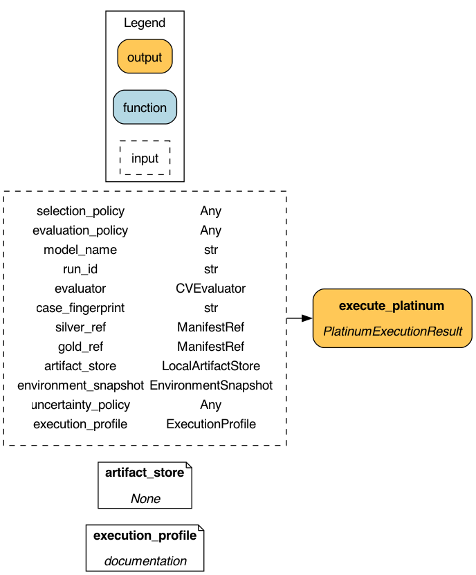

# Platinum fold evidence

Platinum turns verified Silver folds and validation-accepted Gold candidates
into reconstructable model evidence. It never regenerates folds or initializes
an LLM provider. Inputs are joined by authoritative Silver `row_id`, and every
baseline and enhanced validation prediction retains its fold and row identity.



The package contains fold assignments, fold metrics, predictions, aggregate
metrics, paired uncertainty, final feature decisions, checks, and a report.
Only a manifest-backed package with `_SUCCESS`, verified upstream references,
matching baseline/enhanced fold keys, and aggregates that reconstruct from the
stored fold records is reusable.

Metric direction is explicit. A compatibility profile preserves the legacy
numeric `enhanced - baseline` gain and `gain > 0` selection behavior. The
recommended profile evaluates directional improvement, requires a practical
threshold or positive lower confidence bound, and records a reason for every
selected or rejected Gold candidate. Lower-is-better metrics such as RMSE,
MAE, and NRMSE therefore remain numerically compatible while receiving correct
recommended-policy semantics.

Each fold gets a fresh estimator. Resolved estimator class, owning distribution
and version, hyperparameters, seed, preprocessing policy, and thread limits are
part of Platinum identity. Preprocessing is fit only on the training subset,
and both estimator and BLAS thread counts are bounded.

`execute_platinum(...)` is the explicit durable entrypoint. The default legacy
`ExperimentalPlatform.run()` path remains unchanged. Its enriched result
preserves the first nine `ExperimentResult` fields and appends run, stage
fingerprint, manifest, uncertainty, directional-gain, and selection metadata.
Reporter accepts mixed legacy and enriched dictionaries.

## Performance

The reproducible performance smoke in
`tests/benchmarks/test_performance_smoke.py` compares legacy mean-only
evaluation with explicit-fold evidence on the same persisted folds, asserts
exact aggregate parity, verifies the durable prediction/fold counts, and
enforces the recorded time budget. Candidate evaluation remains
`O(candidates × folds)`; baseline evidence is evaluated once and reused across
candidate decisions.

## Verification

```bash
uv run --extra pipeline pytest tests/unit/test_platinum_dataflow.py -q
uv run pytest tests/unit/test_evaluation.py tests/unit/test_experiment.py -q
uv run pytest tests/benchmarks/test_performance_smoke.py -q
uv run pytest -m "not llm" -q
uv run ruff check .
uv run mypy src
uv run mkdocs build --strict
```
