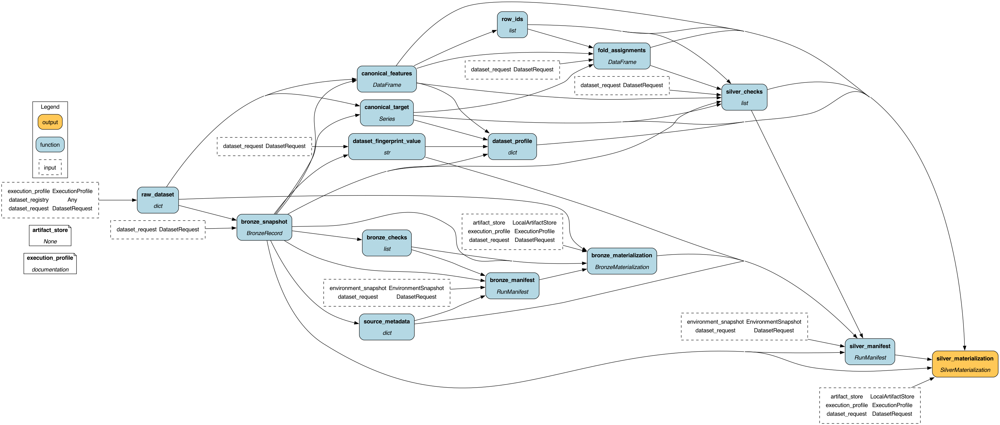

# Silver-first dataflow

The optional `pipeline` extra contains the first Hamilton integration. It
keeps Bronze source identity and Silver canonicalization inspectable while the
existing experiment execution path remains unchanged. Hamilton and DuckDB are
also included by the aggregate `all` extra.



Build the driver in a side-effect-free documentation profile:

```python
from feature_forge.dataflows import ExecutionProfile, build_driver
from feature_forge.dataflows.visualization import render_silver_dag

driver = build_driver(profile=ExecutionProfile.DOCUMENTATION)
render_silver_dag(driver, "docs/generated/silver-dag.png")
```

## Durable boundaries

The dataflow commits two independently verifiable packages:

- Bronze stores `bronze.json` plus either `source_reference.json` or physical
  `train.parquet`/`test.parquet` snapshots, according to `source_policy`.
- Silver stores canonical features and target, stable row IDs, seeded fold
  assignments, the dataset profile/fingerprint, and required check results.

The `ci` profile rejects network-backed registry entries before calling their
loader and performs no persistence. `development` persists when an artifact
store is supplied. `production` and `replay` require an artifact store. A
package is reusable only after its manifest, artifact hashes, layer metadata,
and `_SUCCESS` marker verify. `_SUCCESS` stores the commit-time manifest
SHA-256, so safe reads cannot trust a manifest that was rewritten after
publication.

Every manifest binds itself to a `layer`, matching `package_kind`, and a
layer-specific fingerprint. Safe artifact resolution returns only files
declared by that manifest and rechecks their size and SHA-256 digest. The
Silver replay loader additionally enforces the exact required filenames,
media types, schema version, and descriptor layer for both Silver and its
upstream Bronze package.

## Identity boundaries

Identity contracts are versioned independently from the aggregate case ID:

| Identity | Includes | Excludes |
| --- | --- | --- |
| Bronze | Source checksum and source contract version | Canonicalization, method, model, metric |
| Silver | Bronze identity, target/task, canonicalization, split policy/seed | Method, prompt, model, metric |
| Gold input | Silver identity, method/version/config, prompts, generated contract, output-changing selection policy | Evaluation model and reporting policy |
| Platinum input | Gold identity, model/version/config, metric, folds, evaluation and uncertainty policy | Tracker and presentation configuration |

The case fingerprint remains an aggregate orchestration identity. Changing a
model or metric therefore preserves Silver; changing prompts or method inputs
invalidates Gold; changing only evaluation inputs invalidates Platinum.

## Per-case execution context

The legacy experiment facade now resolves a `CaseExecutionContext` after
loading validated dataset metadata and before constructing a method or LLM
provider. It carries the dataset task, compatible metric, seed, folds,
evaluation/resource settings, run identity, artifact policy, and execution
profile. Built-in method adapters receive the same resolved settings and
`CVEvaluator` used by outer evaluation. A mixed classification/regression
matrix is supported, and an explicit incompatible task/metric pair fails
before method construction. The regression default is R² so the existing
positive-gain selection contract remains higher-is-better; lower-is-better
metric direction is deferred to the Platinum evaluation-policy work.

Re-executing the same run reuses matching verified packages and rejects a run
ID collision with different inputs. Load Silver offline without consulting a
dataset registry:

```python
from feature_forge.dataflows import load_silver_package

silver = load_silver_package(store, silver_manifest_ref)
X = silver.canonical_features
folds = silver.fold_assignments
```

`load_silver_package` verifies both Silver and its upstream Bronze manifest,
then checks row alignment and the persisted dataset fingerprint before
returning data.
